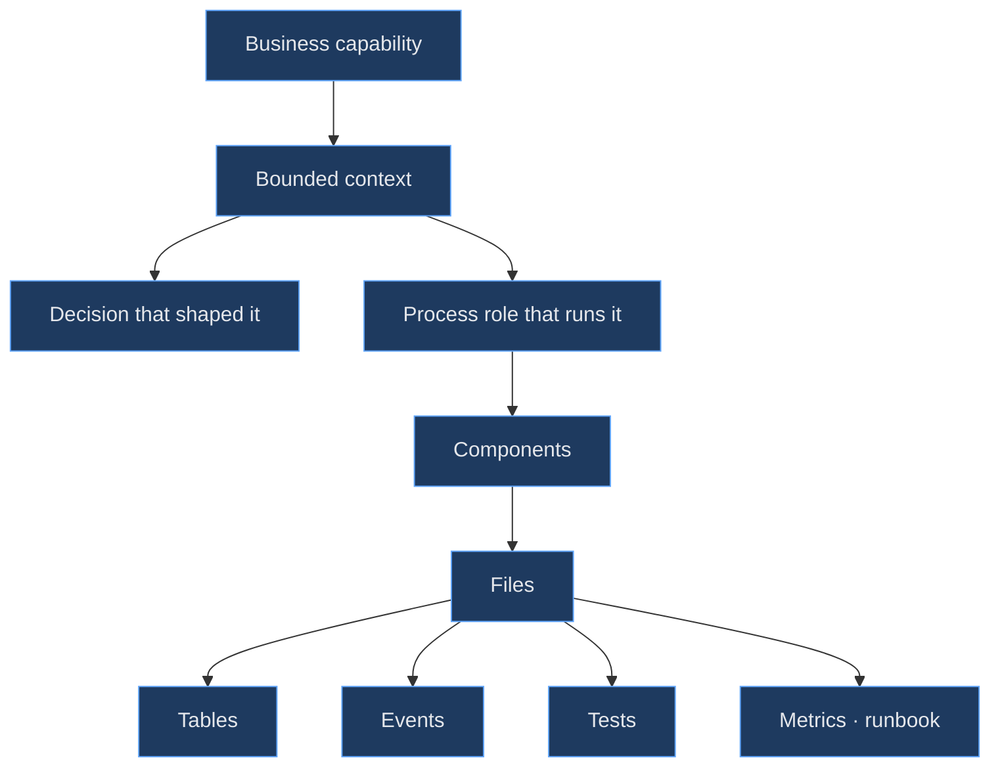

# System Map

> **The master navigation document.** If you know absolutely nothing about this project, start at
> [Start Here](README.md); come back here when you know *what* you're looking for and need to know *where*.
>
> Every row descends: business capability → subsystem → service → component → code → data → events → tests.

---

## The descent

---

## Aegis Nexus → everything

### → Business

| Capability | Doc |
|-----------|-----|
| What the product is and why | [Product overview](../01-product/product-overview.md) |
| Who it's for | [Personas](../01-product/personas.md) |
| What it must do (numbered) | [Requirements](../01-product/requirements.md) |
| Concrete scenarios | [Use cases](../01-product/use-cases.md) |
| Core vs. supporting vs. generic | [Business domains](../01-product/business-domains.md) |
| The words we use | [Domain glossary](../01-product/domain-glossary.md) |

### → Architecture

| Question | Doc |
|----------|-----|
| **What must never be violated** | [Constitution](../02-architecture/architecture-constitution.md) |
| How to decide when the rules are silent | [Principles](../02-architecture/architecture-principles.md) |
| The whole system at six zoom levels | [System overview](../02-architecture/system-overview.md) |
| Who owns what; who may call whom | [Context map](../02-architecture/context-map.md) |
| Deployable units and why they're split | [Container diagram](../02-architecture/container-diagram.md) |
| What's inside the image | [Component diagram](../02-architecture/component-diagram.md) |
| How it runs in production | [Deployment architecture](../02-architecture/deployment-architecture.md) |
| What breaks when X dies | [Failure domains](../02-architecture/failure-domains.md) |
| How to replace a core technology | [Change protocol](../02-architecture/architecture-change-protocol.md) |

### → Decisions

| Question | Doc |
|----------|-----|
| Why is anything the way it is | [ADR index](../11-decisions/README.md) |
| Which decisions constrain which | [Decision graph](../11-decisions/README.md#the-decision-graph) |
| What changed and when | [Architecture changelog](../architecture-changelog.md) |
| What we know is wrong | [Technical debt](../technical-debt.md) |

### → Runtime behavior

| Flow | Doc |
|------|-----|
| A request enters | [Request flow](../02-architecture/request-flow.md) |
| An event propagates | [Event flow](../02-architecture/event-flow.md) |
| Data's full lineage | [Data flow](../02-architecture/data-flow.md) |

### → Subsystems

| Subsystem | Owns | Runs in | Decision | Deep dive |
|-----------|------|---------|----------|-----------|
| Identity | Users, credentials, sessions, service identities | `api` | — | [→](../03-domains/identity/README.md) |
| Organizations | Tenants, memberships, placement | `api` | [ADR-009](../11-decisions/ADR-009-multi-tenancy.md) | [→](../03-domains/organizations/README.md) |
| Authorization | Roles, permissions, policy evaluation | `api` | [ADR-010](../11-decisions/ADR-010-consistency-model.md) | [→](../03-domains/authorization/README.md) |
| Events | Ingest, event store, outbox/inbox, replay | `ingest` `relay` `consumer` | [ADR-003](../11-decisions/ADR-003-event-bus.md) | [→](../03-domains/events/README.md) |
| Workflows | Definitions, versions, durable runtime, approvals | `worker:default` `scheduler` | [ADR-006](../11-decisions/ADR-006-workflow-engine.md) | [→](../03-domains/workflows/README.md) |
| Agents | Runtime, memory, tools, governance | `worker:agents` | [ADR-007](../11-decisions/ADR-007-ai-runtime.md) | [→](../03-domains/agents/README.md) |
| Integrations | Connectors, credentials, webhooks, delivery | `worker:default` `ingest` | — | [→](../03-domains/integrations/README.md) |
| Documents | Ingestion, chunking, embeddings, retrieval | `worker:documents` | [ADR-008](../11-decisions/ADR-008-vector-database.md) | [→](../03-domains/documents/README.md) |
| Notifications | Channels, delivery, real-time push | `worker:default` | — | [→](../03-domains/notifications/README.md) |
| Billing | Metering, budgets, cost attribution | `consumer` | — | [→](../03-domains/billing/README.md) |
| Audit | Immutable trail, timelines, verification | all | [ADR-005](../11-decisions/ADR-005-event-sourcing.md) | [→](../03-domains/audit/README.md) |

### → Distributed systems mechanics

| Mechanism | Doc |
|-----------|-----|
| Event sourcing (four aggregates only) | [→](../04-distributed-systems/event-sourcing.md) |
| CQRS (selective) | [→](../04-distributed-systems/cqrs.md) |
| Outbox / Inbox | [→](../04-distributed-systems/outbox-pattern.md) · [→](../04-distributed-systems/inbox-pattern.md) |
| Idempotency | [→](../04-distributed-systems/idempotency.md) |
| Sagas & compensation | [→](../04-distributed-systems/sagas.md) |
| Consistency model | [→](../04-distributed-systems/consistency-model.md) |
| Ordering guarantees | [→](../04-distributed-systems/ordering-guarantees.md) |
| Failure recovery | [→](../04-distributed-systems/failure-recovery.md) |

### → AI

| Topic | Doc |
|-------|-----|
| Agent runtime | [→](../05-ai/agent-runtime.md) |
| Tool system | [→](../05-ai/tool-system.md) |
| Memory | [→](../05-ai/agent-memory.md) |
| RAG | [→](../05-ai/rag.md) |
| Model routing | [→](../05-ai/model-routing.md) |
| Cost governance | [→](../05-ai/token-governance.md) |
| Human-in-the-loop | [→](../05-ai/human-in-the-loop.md) |
| AI security | [→](../08-security/ai-security.md) |

### → Data

[Database architecture](../06-data/database-architecture.md) · [Schema](../06-data/schema.md) ·
[Indexing](../06-data/indexing-strategy.md) · [Partitioning](../06-data/partitioning.md) ·
[Caching](../06-data/caching.md) · [Search](../06-data/search.md) ·
[Vector storage](../06-data/vector-storage.md) · [Retention](../06-data/data-retention.md)

### → Infrastructure

[Overview](../07-infrastructure/infrastructure-overview.md) · [Kubernetes](../07-infrastructure/kubernetes.md) ·
[Autoscaling](../07-infrastructure/autoscaling.md) · [Multi-region](../07-infrastructure/multi-region.md) ·
[Disaster recovery](../07-infrastructure/disaster-recovery.md)

### → Security

[Architecture](../08-security/security-architecture.md) · [Threat model](../08-security/threat-model.md) ·
[Tenant isolation](../08-security/tenant-isolation.md) · [Authentication](../08-security/authentication.md) ·
[Authorization](../08-security/authorization.md) · [Secrets](../08-security/secrets-management.md) ·
[Findings register](../security/findings.md)

### → Observability & operations

[Observability](../09-observability/observability-architecture.md) · [Metrics](../09-observability/metrics.md) ·
[Tracing](../09-observability/tracing.md) · [Alerting](../09-observability/alerting.md) ·
[Debugging](../09-observability/debugging.md) · [Runbooks](../12-operations/runbooks/) ·
[Deployment](../12-operations/deployment.md) · [Incidents](../12-operations/incident-management.md)

### → Performance

[Model](../10-performance/performance-model.md) · [Capacity](../10-performance/capacity-planning.md) ·
[Bottlenecks](../10-performance/bottlenecks.md) · [Register](../performance/performance-register.md)

### → Code

[Codebase navigation](codebase-navigation.md) — every subsystem's entry point, public API, tables, events, jobs, tests.

---

## Task-oriented index

| I need to… | Go to |
|-----------|-------|
| Debug a failed workflow | [Debugging](../09-observability/debugging.md) → [workflow stuck runbook](../12-operations/runbooks/workflow-stuck.md) |
| Change an agent's permissions | [Tool system](../05-ai/tool-system.md) → [Authorization](../03-domains/authorization/README.md) |
| Change an event schema | [Events reference](../13-reference/events.md) → [INV-10](../02-architecture/architecture-constitution.md#inv-10--events-are-versioned-and-additively-evolved) |
| Add an integration | [Integrations](../03-domains/integrations/README.md) |
| Change the database schema | [Schema](../06-data/schema.md) → [INV-11](../02-architecture/architecture-constitution.md#inv-11--schema-changes-are-safe-for-rolling-deployment) |
| Change AI model routing | [Model routing](../05-ai/model-routing.md) |
| Investigate a cost spike | [Token governance](../05-ai/token-governance.md) → [Billing](../03-domains/billing/README.md) |
| Add a new bounded context | [Context map](../02-architecture/context-map.md) + an ADR |
| Replace a core technology | [Change protocol](../02-architecture/architecture-change-protocol.md) |
| Understand why CI failed on docs | [docs-lint](../../tools/docs-lint/README.md) |
| Understand why CI failed on boundaries | [boundary-check](../../tools/boundary-check/README.md) |
