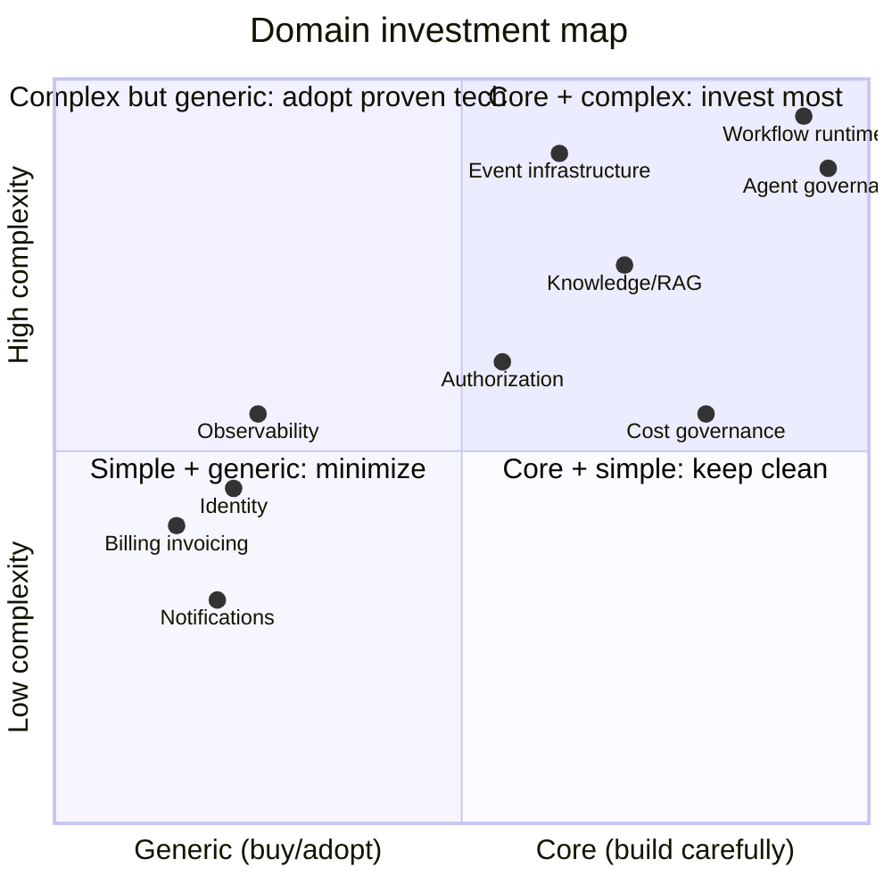

# Business Domains

> This document maps *business capability* → *bounded context* → *code location*. It is Level 0 of the
> [architecture maps](../02-architecture/system-overview.md#abstraction-levels).

## Domain classification (core / supporting / generic)

Classifying domains prevents over-investing in commodity concerns and under-investing in differentiators.
This classification directly drives build-vs-buy and where custom complexity is *allowed*.

| Domain | Class | Why | Build or adopt |
|--------|-------|-----|----------------|
| **Workflow runtime** | Core | Durability semantics *are* the product | Build (see [ADR-006](../11-decisions/ADR-006-workflow-engine.md)) |
| **Agent governance** | Core | Nobody else enforces permissions + budgets + audit the way we must | Build |
| **Cost governance** | Core | Directly determines whether AI is deployable in an enterprise | Build |
| **Knowledge / RAG** | Core-ish | Retrieval quality is differentiating; storage is not | Build pipeline, adopt stores |
| **Event infrastructure** | Supporting | Well-understood patterns, but must be exactly right | Adopt broker, build outbox/inbox |
| **Authorization** | Supporting | Standard model, non-standard subjects (agents) | Build thin layer over standard model |
| **Identity** | Generic | Solved problem | Adopt (OIDC/SAML), thin local layer |
| **Notifications** | Generic | Commodity | Adopt providers, build routing |
| **Billing invoicing** | Generic | Commodity | Adopt (metering is ours, invoicing is not) |
| **Observability** | Generic | Commodity | Adopt OTel + backend |

## Capability → context → code

| Business capability | Bounded context | Code (planned) | Docs |
|---------------------|-----------------|----------------|------|
| "Who are you, and are you still you?" | Identity | `apps/control-plane/domains/identity/` | [→](../03-domains/identity/README.md) |
| "Whose data is this?" | Organizations | `.../domains/organizations/` | [→](../03-domains/organizations/README.md) |
| "Are you allowed to do that?" | Authorization | `.../domains/authorization/` | [→](../03-domains/authorization/README.md) |
| "Something happened" | Events | `.../domains/events/` | [→](../03-domains/events/README.md) |
| "Do this reliably, for as long as it takes" | Workflows | `.../domains/workflows/` | [→](../03-domains/workflows/README.md) |
| "Decide something, within limits" | Agents | `.../domains/agents/` | [→](../03-domains/agents/README.md) |
| "Talk to the outside world" | Integrations | `.../domains/integrations/` | [→](../03-domains/integrations/README.md) |
| "Know things" | Documents / Knowledge | `.../domains/documents/` | [→](../03-domains/documents/README.md) |
| "What did this cost?" | Billing | `.../domains/billing/` | [→](../03-domains/billing/README.md) |
| "Tell someone" | Notifications | `.../domains/notifications/` | [→](../03-domains/notifications/README.md) |
| "Prove it" | Audit | `.../domains/audit/` | [→](../03-domains/audit/README.md) |

The precise ownership rules and forbidden dependencies are in the [context map](../02-architecture/context-map.md);
they are mechanically enforced (NFR-505) by the boundary check described there.
