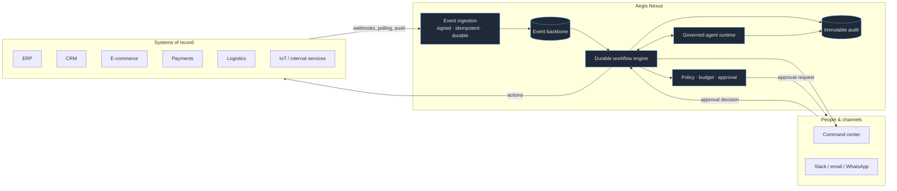

# Product Overview — Aegis Nexus

> **Audience:** anyone, technical or not, on their first day.
> **Reading time:** ~10 minutes.
> **Next:** [Personas](personas.md) → [Use Cases](use-cases.md) → [Requirements](requirements.md) → [System Overview](../02-architecture/system-overview.md)

---

## 1. The one-sentence version

Aegis Nexus is an **autonomous distributed operations and intelligence platform**: it sits between a company's
systems, its people, and a fleet of AI agents, turning raw events from those systems into *decisions, workflows,
approvals, and auditable actions*.

## 2. The problem

Mid-size and large organizations do not suffer from a lack of software. They suffer from the **gaps between**
their software.

An order is created in the e-commerce platform. Inventory lives in the ERP. Payment status lives at the payment
provider. The fraud signal lives in a risk vendor. The customer's complaint history lives in the CRM. The person
who can approve a R$ 8,500 refund is in Slack. The audit requirement lives in a policy PDF that nobody has read
since 2021.

Today, that gap is filled by three things, all of them bad:

1. **Humans** copying data between tabs — slow, expensive, inconsistent, unauditable.
2. **Point-to-point integrations** — an N² mesh of brittle scripts, each with its own retry logic (or none),
   its own credentials, and its own silent failure mode.
3. **Rules buried in application code** — business policy encoded in a controller somewhere, invisible to the
   business, impossible to change without a deploy.

Layering LLMs onto this naively makes it *worse*, not better. An agent with a database connection and no
permission boundary is a data breach with a friendly interface. An agent with no cost ceiling is an unbounded
invoice. An agent whose reasoning is not recorded is a compliance finding waiting to happen.

## 3. What Aegis Nexus does

Aegis Nexus provides **one durable, observable, governed operational layer**:

The platform's job is to make the following sentence true, for thousands of tenants at once:

> *"Every meaningful thing that happened in our business was captured, evaluated against our policies, acted on
> by either a person or an agent operating inside explicit limits, and is fully reconstructable six months later."*

## 4. The canonical example

A high-value order arrives. This is the example used throughout the documentation — it is deliberately the
same story everywhere, so you can trace one scenario end-to-end across every layer.

| # | Step | Where it is documented |
|---|------|------------------------|
| 1 | Webhook received from the shop | [Webhook platform](../03-domains/integrations/README.md) |
| 2 | HMAC signature verified, timestamp window checked | [Authentication](../08-security/authentication.md) |
| 3 | Idempotency key checked (dedup) | [Idempotency](../04-distributed-systems/idempotency.md) |
| 4 | Event persisted in the tenant's event store | [Event sourcing](../04-distributed-systems/event-sourcing.md) |
| 5 | Published to the backbone via the transactional outbox | [Outbox pattern](../04-distributed-systems/outbox-pattern.md) |
| 6 | Business rules evaluated → workflow triggered | [Workflow engine](../03-domains/workflows/README.md) |
| 7–9 | Inventory / customer history / anomaly checks | [Workflow steps](../03-domains/workflows/step-types.md) |
| 10 | An agent is invoked with a scoped tool set | [Agent runtime](../05-ai/agent-runtime.md) |
| 11–12 | Workflow + tasks created | [Workflow runtime](../03-domains/workflows/runtime.md) |
| 13–14 | Human approval requested; workflow sleeps, then resumes | [Human-in-the-loop](../05-ai/human-in-the-loop.md) |
| 15 | External systems called with compensations registered | [Sagas](../04-distributed-systems/sagas.md) |
| 16 | Every decision recorded | [Audit](../03-domains/audit/README.md) |
| 17 | Projections updated | [CQRS](../04-distributed-systems/cqrs.md) |
| 18 | Users notified in real time | [Notifications](../03-domains/notifications/README.md) |
| 19 | Operational + AI cost attributed | [Cost governance](../05-ai/token-governance.md) |
| 20 | Full execution timeline exposed | [Observability](../09-observability/observability-architecture.md) |

**Every one of those twenty stages must tolerate partial failure.** That single requirement is what forces most
of the architecture in this repository. See [Failure domains](../02-architecture/failure-domains.md).

## 5. What Aegis Nexus is *not*

Explicit non-goals matter as much as goals; they are the reason certain "obvious" features are absent.

| Not a… | Why not | What we do instead |
|--------|---------|--------------------|
| Data warehouse / BI tool | We are an *operational* system optimized for low-latency decisions on recent state, not petabyte analytical scans | Emit to the customer's warehouse via [data lineage](../06-data/data-lineage.md) exports |
| iPaaS / ETL pipeline | Moving rows is a commodity; deciding and governing is not | Integrations exist to feed decisions, not to sync tables |
| Chat product | The chat box is a *thin* surface over a governed runtime; the runtime is the product | Agents are invoked by workflows and events far more often than by humans |
| Model provider | We are provider-agnostic on purpose ([ADR-007](../11-decisions/ADR-007-ai-runtime.md)) | Routing + fallback across providers |
| General-purpose PaaS | We do not run arbitrary customer code as a primary feature | Sandboxed, resource-capped code steps only |

## 6. Why this is hard (the engineering thesis)

Any one of these is a normal engineering project. The product is the *intersection*:

1. **Durability across weeks.** A workflow waiting on a human approval must survive deploys, crashes, and
   process restarts, then resume at exactly the right instruction. Nothing may live only in process memory.
2. **Correct-once semantics on an at-least-once substrate.** The network will deliver duplicates. The platform
   must make duplicate delivery *harmless*, not merely rare.
3. **Multi-tenancy that is enforced, not intended.** Isolation must hold at the database, cache, search, vector,
   queue, and prompt layers simultaneously. A single missing `WHERE tenant_id = ?` is a breach.
4. **Non-deterministic components inside deterministic guarantees.** LLMs are unreliable, expensive, and
   manipulable by the very data they read. They must be wrapped in permissions, budgets, timeouts, and audit.
5. **Understandability.** A system that only its authors can operate has failed. The documentation in `/docs`
   is a first-class deliverable, not an afterthought — see the [documentation contract](../00-start-here/README.md#the-documentation-contract).

## 7. Business domains at a glance

| Domain | Owns | Deep dive |
|--------|------|-----------|
| Identity | Users, credentials, sessions, service identities | [→](../03-domains/identity/README.md) |
| Organizations | Tenants, teams, memberships, tenant lifecycle | [→](../03-domains/organizations/README.md) |
| Authorization | Roles, permissions, policy evaluation (RBAC + ABAC) | [→](../03-domains/authorization/README.md) |
| Events | Ingestion, event store, backbone, replay | [→](../03-domains/events/README.md) |
| Workflows | Definitions, versions, durable runtime, approvals | [→](../03-domains/workflows/README.md) |
| Agents | Agent runtime, memory, tools, governance | [→](../03-domains/agents/README.md) |
| Integrations | Connectors, credentials, webhooks, delivery | [→](../03-domains/integrations/README.md) |
| Documents | Ingestion pipeline, chunking, embeddings, RAG | [→](../03-domains/documents/README.md) |
| Billing | Usage metering, budgets, cost attribution | [→](../03-domains/billing/README.md) |
| Notifications | Channels, delivery, real-time push | [→](../03-domains/notifications/README.md) |
| Audit | Immutable trail, timelines, compliance export | [→](../03-domains/audit/README.md) |

Full boundary analysis: [Context map](../02-architecture/context-map.md).

## 8. Where to go next

- **"I want the 30-minute tour"** → [System tour](../00-start-here/system-tour.md)
- **"I want the mental model before any code"** → [Mental model](../00-start-here/mental-model.md)
- **"I want to know the rules I must not break"** → [Architecture Constitution](../02-architecture/architecture-constitution.md)
- **"I want the numbered requirements"** → [Requirements](requirements.md)
- **"I want to start coding today"** → [Developer onboarding](../00-start-here/developer-onboarding.md)
