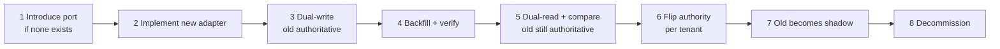

# Architecture Change Protocol

> How to replace a load-bearing technology without discovering the hard parts in production.
>
> Applies to: PostgreSQL, Kafka, Redis, Kubernetes, the vector store, an AI provider, the authentication system,
> or the workflow engine. If replacing it would change an ADR, this protocol applies.

---

## Why a protocol rather than a project plan

Replacements fail in a predictable way: the *migration* is planned and the *coexistence period* is not. For
weeks or months both systems are live, and every question during that window — which is authoritative? what
happens to in-flight work? how do we roll back after the cutover? — is answered under pressure if it was not
answered in advance.

The nine steps below exist to force those answers out early, while they are cheap.

---

## The nine steps

### 1. Dependencies — what actually touches it

Enumerate every consumer, not the ones you remember. Grep, then check: application code, migrations, jobs,
runbooks, dashboards, alerts, CI, local development, disaster-recovery procedures, and the
[failure matrix](failure-domains.md) rows that name it.

**Output:** a list. If it is short, you have not looked hard enough.

### 2. Affected systems — including the non-obvious

| Category | Ask |
|----------|-----|
| Code | Which contexts import it? Which ports abstract it? |
| Data | Does it hold authoritative state, or derived? |
| Operations | Which runbooks, alerts, and dashboards assume it? |
| Contracts | Does any external behavior depend on its semantics (ordering, durability, latency)? |
| Documents | Which ADRs and diagrams describe it? |

The contracts row is the one that bites. Replacing a broker whose ordering guarantee differs changes a promise
the platform made to itself (FR-205), even if no code fails to compile.

### 3. Migration — the coexistence period is the plan

Default shape:

Rules that make this survivable:

- **Exactly one system is authoritative at any moment.** "Both" is not a state; it is an outage waiting for a
  disagreement.
- **Flip per tenant**, not globally. A per-tenant flip is a controlled experiment; a global flip is a bet.
- **Dual-read comparison runs in production**, logging divergence without serving it, for at least one full
  business cycle. Divergence you have not measured is divergence you will discover from a customer.
- **In-flight work must be enumerated** before the flip: open workflow runs, unpublished outbox rows,
  unacknowledged messages, suspended approvals.

### 4. Rollback — and the point of no return

State plainly:

- How to revert at each step.
- **The specific moment after which rollback is no longer possible** (usually: the old system stopped receiving
  writes and its data has aged past usefulness).
- How long the old system stays warm after cutover. Default: one full business cycle, minimum two weeks.

A migration plan without an explicit point of no return has one anyway — it is just undocumented.

### 5. Compatibility — during, not only after

- Do old and new coexist behind one port, or does calling code change?
- Are semantics *identical* or merely *similar*? Enumerate differences: ordering, durability, delivery,
  transactionality, latency distribution, failure modes.
- Does anything depend on a behavior the new system does not have?

Similar-but-different semantics are the most expensive category, because the code compiles and the tests pass.

### 6. Data migration

Volume, throughput, and therefore duration. Verification method (counts are not enough — checksums per tenant).
What happens to data written *during* the migration. Whether the source stays readable for the rollback window.

### 7. Operational risks

New failure modes, new runbooks, new alerts, on-call training, and — honestly — whether the team has ever
operated this technology under stress. "We'll learn it in production" is a plan; it should be stated as one.

### 8. Security implications

New credentials and rotation. New network paths. Whether tenant isolation is enforced the same way — this is the
question that killed alternatives in
[ADR-008](../11-decisions/ADR-008-vector-database.md): a store where isolation depends on our query construction
rather than the database's RLS is a different security posture, not merely a different technology.

Also: does it change the audit trail? Does data cross a new boundary?

### 9. Cost implications

Fixed vs. marginal, before and after. **The coexistence period costs both**, and it is the longest phase. Include
engineering time honestly; it usually exceeds the infrastructure delta.

---

## Deliverables

| Deliverable | When |
|-------------|------|
| Migration ADR (supersedes the old one) | Before any code |
| Coexistence plan with the rollback point | Before dual-write |
| Verification method + divergence budget | Before dual-read |
| Updated runbooks, alerts, dashboards | Before the first tenant flips |
| Updated diagrams and affected docs | Same PR as each change (INV-26) |
| Changelog entry | At cutover |

---

## Pre-authorized replacements

Some replacements already have their triggers and analysis written, so they start at step 3 rather than step 1:

| Component | Trigger | Where |
|-----------|---------|-------|
| Workflow engine → Temporal | Throughput, incident count, or maintenance-share thresholds | [ADR-006](../11-decisions/ADR-006-workflow-engine.md) |
| pgvector → Qdrant | Corpus size, recall, latency, or index-maintenance thresholds | [ADR-008](../11-decisions/ADR-008-vector-database.md) |
| Postgres FTS → OpenSearch | Search p95 or faceting requirements | [ADR-002](../11-decisions/ADR-002-database.md) |
| Usage aggregation → ClickHouse | Aggregation p95 or row volume | [ADR-002](../11-decisions/ADR-002-database.md) |
| Kafka → NATS JetStream | None — recorded as the closest runner-up, rejected on operational familiarity | [ADR-003](../11-decisions/ADR-003-event-bus.md) |

Pre-committing triggers is what turns "we should probably migrate someday" into a decision with a date attached.

## Related

[ADR index](../11-decisions/README.md) · [Changelog](../architecture-changelog.md) ·
[Failure domains](failure-domains.md)
