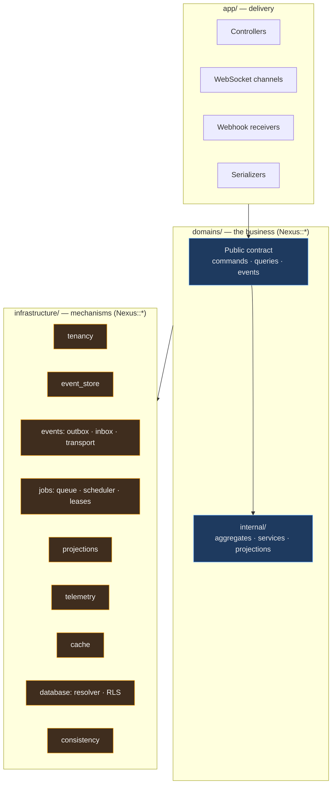
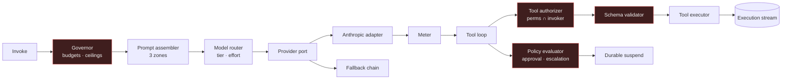

# Component Diagram (Level 3)

> What is inside the control-plane image. Level 2 (deployable units) is the
> [container diagram](container-diagram.md); level 5 (files) is
> [codebase navigation](../00-start-here/codebase-navigation.md).

---

## Layering



Two rules, both checkable:

- **`app/` contains no business logic.** A controller validates, authorizes, delegates to a command, and
  serializes. If it branches on domain state, the logic is in the wrong place.
- **`infrastructure/` contains no domain vocabulary.** It knows about streams, leases, and offsets — never
  about approvals or budgets. The moment it does, extracting a context becomes impossible.

The direction of dependency is strictly downward. `infrastructure/` never references `domains/`.

---

## Anatomy of a bounded context

Every context has the same shape, so knowing one means knowing all eleven:

```
domains/workflows/
├── trigger.rb              PUBLIC  — a command other contexts may invoke
├── run.rb                  PUBLIC  — a query object
├── approve.rb              PUBLIC
└── internal/                        PRIVATE (boundary-check enforces this)
    ├── aggregates/                  decide(command, state) → events
    │                                apply(event, state) → state   ← NO I/O in apply
    ├── engine/                      the durable interpreter
    ├── steps/                       one class per step type
    ├── projections/                 event handlers → read models
    ├── models/                      ActiveRecord, tables this context owns
    └── events/                      event payload definitions + versions
```

`ownership.yml` declares which constants are public and which tables belong here;
[boundary-check](../../tools/boundary-check/README.md) fails the build on violations.

---

## Infrastructure components

| Component | Responsibility | Invariant it serves |
|-----------|---------------|---------------------|
| `tenancy` | Request/job-scoped tenant context; **raises when absent** | INV-14 layer (c) |
| `database/tenant_resolver` | Principal → organization → placement → connection | ADR-009 |
| `database/rls` | Sets the session variable RLS policies read | INV-14 layer (a) |
| `event_store` | Append with `expected_sequence`; snapshots; upcasting; replay | ADR-005 |
| `events/publisher` | **Raises outside a transaction** — makes the outbox structural | INV-04 |
| `events/outbox_relay` | Claims unpublished rows, publishes, marks sent | INV-04 |
| `events/consumer` | Inbox dedup → handler; **refuses a handler with no dedup key** | INV-05 |
| `events/transport` | Port: `KafkaTransport` / `PostgresLogTransport` | ADR-003 |
| `jobs` | Due-time queue, `SKIP LOCKED` claiming, leases, fair dispatch | ADR-006, NFR-403 |
| `projections` | Order-tolerant apply, lag tracking, shadow rebuild + swap | ADR-004 |
| `consistency` | Reconciliation jobs, consistency tokens | ADR-010 Rule 3 |
| `telemetry` | Trace propagation across async hops; redaction filter | INV-23, INV-18 |
| `cache` | Tenant-prefixed keys; **no raw client access** | INV-14 |

Several of these enforce their invariant by **refusing to work when misused** rather than by documenting the
rule — `Publisher` raising outside a transaction, `Consumer` refusing an undedup'd handler, `tenancy` raising
on absent context. That is [P1](architecture-principles.md#p1--make-the-correct-thing-the-easy-thing) applied:
make the correct thing the easy thing, and the incorrect thing impossible.

---

## The agent runtime (the most component-dense subsystem)



Red nodes are the control points that cannot be delegated to a vendor loop — the argument in
[ADR-007](../11-decisions/ADR-007-ai-runtime.md).

---

## Related

[Container diagram](container-diagram.md) · [Context map](context-map.md) ·
[Codebase navigation](../00-start-here/codebase-navigation.md)
