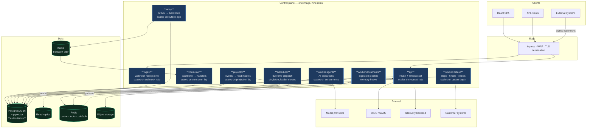

# Container Diagram (Level 2)

> "Container" = **independently deployable and scalable unit**, not "Docker image". There is exactly one image
> ([ADR-001](../11-decisions/ADR-001-architecture-style.md)); the roles below are that image started with a
> different `NEXUS_ROLE`.
>
> Level 1 (context) and the reasoning behind this split: [system overview](system-overview.md).

---

## The deployable units



---

## Why each role is separate

A role exists when it has a **different scaling signal** or a **different failure containment need**. Splitting
on any other basis just multiplies pods.

| Role | Separate because | If it were merged into `api` |
|------|------------------|------------------------------|
| `ingest` | Extreme request rate, near-zero logic | A webhook storm would consume the threads serving interactive users |
| `relay` | Must keep publishing under load; failure is *silent* | Under API load, publication would starve and every downstream automation would silently lag |
| `consumer` | Scales with partitions, not requests | Consumer rebalances would stall API threads |
| `projector` | Rebuilds are long and bursty | A rebuild would compete with p95-sensitive traffic |
| `worker:agents` | Latency-bound (seconds), not CPU-bound | 25 blocked threads per pod would need 25 API threads too |
| `worker:documents` | Memory-heavy, hostile input | A parser OOM would take down request serving |
| `scheduler` | Singleton semantics | N API pods would each fire every timer |

## Concurrency models differ per role

Worth stating because it is the most common sizing mistake:

| Role | Bound by | Threads/pod | Sizing driver |
|------|----------|-------------|---------------|
| `api` | CPU + DB latency | ~8 | Connection pool budget |
| `worker:agents` | **Waiting on a network call** | ~25 | Provider concurrency limits, not CPU |
| `worker:documents` | Memory + CPU | ~4 | Peak per-document memory |
| `relay` | DB write throughput | ~4 | Batch size × publish latency |

`worker:agents` running the same thread count as `api` would waste roughly two thirds of its capacity sitting
in `read()` — which is precisely why it is a separate role rather than a queue on a shared worker.

## Connection budgets

Every role draws from the same PostgreSQL connection ceiling, so budgets are assigned rather than assumed
(the mitigation named in [ADR-001](../11-decisions/ADR-001-architecture-style.md)):

```
PgBouncer (transaction pooling)
 ├── api             40%   latency-critical, must never be starved
 ├── workers         35%
 ├── consumer+relay  15%   starving these is silent, so they get a floor
 ├── projector        7%
 └── scheduler        3%
```

Without per-role budgets, a worker autoscale event exhausts the pool and the API returns 500s for a reason that
has nothing to do with the API.

## Deployment properties

| Property | Value |
|----------|-------|
| Image | One, built once per commit; roles differ only by `NEXUS_ROLE` |
| Migrations | A separate job (`NEXUS_ROLE=migrate`), never an app-boot side effect (INV-11) |
| Rollout order | Workers and consumers first, `api` last — N/N+1 compatibility makes the mixed state safe |
| Drain | SIGTERM → finish or release leases; `tini` forwards the signal |
| Probes | Every role answers `/healthz`, including non-HTTP roles |

## Related

[Component diagram](component-diagram.md) (level 3) · [Deployment architecture](deployment-architecture.md) ·
[`config/roles.yml`](../../apps/control-plane/config/roles.yml) · [Failure domains](failure-domains.md)
