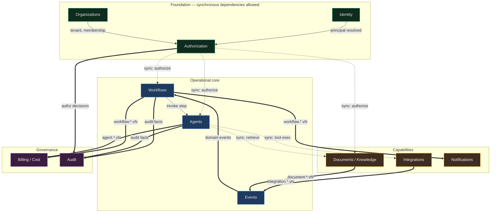

# Context Map

> The authoritative statement of **who owns what** and **who may talk to whom**. Enforced by
> `tools/boundary-check` ([INV-01](architecture-constitution.md#inv-01--a-bounded-context-owns-its-tables-exclusively),
> [INV-02](architecture-constitution.md#inv-02--the-published-contract-is-the-only-public-surface)).
>
> If this document and the code disagree, the build fails. That is the point.

---

## The map

**Legend:** `==>` asynchronous (events, the default per [INV-03](architecture-constitution.md#inv-03--contexts-communicate-asynchronously-by-default)) ·
`-.->` synchronous (allowed only with the justification below).

---

## Ownership register

Each context owns its tables exclusively. No other module may read them — not with a join, not with a
"read-only" query, not "just this once".

| Context | Owns (tables) | Published contract | Consumes |
|---------|---------------|--------------------|----------|
| **Identity** | `users`, `sessions`, `service_identities` | `Identity::Authenticate`, `Identity::Principal` (value), `Identity::IssueToken`, `Identity::RevokeToken`, `Identity::RegisterServiceIdentity` | Organizations (membership lookup) |
| **Organizations** | `organizations`, `memberships`, `teams`, `team_memberships`, `org_placements` | `Organizations::Tenant` (query), `Organizations::Membership` (query), `Organizations::ProvisionOrganization`, `organization.*` events | Identity (principal ids), Authorization (role seeding) |
| **Authorization** | `roles`, `permissions`, `role_permissions`, `grants`, `policies` | `Authorization::Authorize.call!(principal, action, resource_type, attributes:)`, `Authorization::PermissionSet`, `Authorization::Policy`, `Authorization::PermissionCatalog`, `Authorization::AssignRole`, `Authorization::SeedSystemRoles` | Organizations (membership id), Identity (principal) |
| **Events** | `ingested_events`, `event_store_events`, `outbox_messages`, `inbox_messages`, `dead_letter_messages` | `Events::Publisher`, `Events::Consumer`, `Events::Replay` | — (infrastructural) |
| **Workflows** | `workflow_definitions`, `workflow_versions`, `workflow_runs`, `step_executions`, `approval_requests`, `scheduled_jobs` | `Workflows::Trigger`, `Workflows::Run` (query), `workflow.*` events | Events, Authorization, Agents, Integrations |
| **Agents** | `agents`, `agent_versions`, `agent_executions`, `agent_memories`, `tool_registrations`, `tool_invocations` | `Agents::Invoke`, `Agents::Execution` (query), `agent.*` events | Authorization, Documents, Integrations, Billing |
| **Integrations** | `integrations`, `connections`, `credentials_encrypted`, `webhook_endpoints`, `deliveries` | `Integrations::Call`, `Integrations::Webhook`, `integration.*` events | Authorization |
| **Documents / Knowledge** | `documents`, `document_chunks`, `chunk_embeddings`, `ingestion_jobs` | `Knowledge::Retrieve`, `Documents::Ingest`, `document.*` events | Authorization, Events |
| **Notifications** | `notification_channels`, `notification_deliveries`, `subscriptions` | `Notifications::Send` | Events (subscribes broadly) |
| **Billing / Cost** | `budgets`, `usage_records`, `cost_rollups`, `reservations` | `Billing::Meter`, `Billing::CheckBudget`, `Billing::Usage` (query) | Events (subscribes broadly) |
| **Audit** | `audit_records`, `audit_chains` | `Audit::Record`, `Audit::Timeline` (query), `Audit::Verify` | — (write-only inbound) |

**Platform-global tables** (exempt from `organization_id`, per [INV-13](architecture-constitution.md#inv-13--every-business-row-is-attributable-to-exactly-one-tenant)):
`schema_migrations`, `ar_internal_metadata`, `event_type_registry`, `tool_catalog_templates`, `regions`,
`feature_flags`. Adding to this list requires an ADR.

---

## Permitted synchronous calls

Async is the default. Every synchronous cross-context call is listed here with the reason the caller genuinely
cannot proceed without the answer. A synchronous call not on this list fails review.

| Caller → Callee | Why it must be synchronous | Failure behavior |
|-----------------|---------------------------|------------------|
| Any → **Authorization** | The request cannot proceed without a decision; and per [ADR-010](../11-decisions/ADR-010-consistency-model.md) Rule 1, an authorization decision may never read stale state | **Fail closed** — deny |
| Any → **Organizations** (tenant resolution) | Must know the tenant before touching any data | Fail closed — reject request |
| **Workflows** → **Agents** | The step's output *is* the agent's decision | Step retries with backoff; run parks, never silently fails |
| **Agents** → **Documents** (retrieval) | The prompt cannot be assembled without the retrieved context | Degrade to keyword-only, then to no-context with an explicit note in the execution record |
| **Agents** → **Integrations** (tool execution) | The tool result feeds the next model turn | Tool error is returned to the model *as data*; never crashes the execution |
| **Agents/Workflows** → **Billing** (budget check) | Must not spend before checking | Fail closed — halt before spend |

> **Note the pattern:** every synchronous edge has a defined degradation. A synchronous dependency without a
> declared failure behavior is an availability multiplier hiding as a design decision.

---

## Forbidden dependencies (explicitly enumerated)

These are the mistakes the boundary check exists to catch, listed so reviewers know what to look for:

| Forbidden | Why it is tempting | What to do instead |
|-----------|--------------------|--------------------|
| Workflows joining `agent_executions` to build a timeline | It's one join and the data is right there | Consume `agent.execution.completed.v1`; project into the workflow timeline read model |
| Billing reading `workflow_runs` for cost attribution | Cost "obviously" belongs to a run | Runs emit usage facts; Billing owns `usage_records` |
| Agents reading `memberships` to check a user's team | Convenient for tool authorization | `Authorization.authorize!` — team membership is an authorization input, not agent logic |
| Notifications reading `users.email` | Sending mail needs an address | Notification events carry a resolved recipient reference; Identity exposes contact resolution |
| Documents reading `organizations` for a residency flag | Needed for placement | Tenant context carries placement; it is set at the edge |
| Any context writing `audit_records` directly | It is just an insert | `Audit::Record` — the hash chain must not be bypassed |
| Any context writing to another's outbox | "It's the same table anyway" | Each context publishes its own events (INV-04) |
| Agents importing a provider SDK | It is right there in the Gemfile | Only `providers/anthropic_adapter.rb` may ([ADR-007](../11-decisions/ADR-007-ai-runtime.md)) |

---

## Relationship patterns (DDD)

Named because they change how each side should behave when the other changes — not for decoration.

| Relationship | Pattern | Consequence |
|-------------|---------|-------------|
| Authorization → all | **Conformist** | Everyone adopts Authorization's vocabulary (action, resource, effect). No local permission dialects |
| Events → all | **Published Language** | The event catalog is the shared language; changes are additive-only (INV-10) |
| Workflows → Agents | **Customer/Supplier** | Workflows drives Agents' contract; Agents may not break it unilaterally |
| Integrations → external systems | **Anti-Corruption Layer** | External payload shapes never leak past the connector; they are translated into `integration.*` events |
| Documents → Agents | **Open Host Service** | `Knowledge::Retrieve` is a stable service consumed by many; it does not know about agents |
| Billing → all | **Published Language (metering)** | Everyone emits usage facts in one shape; Billing never inspects producers |
| Audit → all | **Open Host Service (write-only)** | Audit accepts records; it never calls back into producers, so it can never be a source of failure for them |

The Integrations ACL is the most operationally important: **external systems are the primary source of chaos**
in this platform, and the connector layer is where that chaos is contained. A provider changing a field name
should break one connector, not the workflow engine.

---

## Extraction readiness

Because contexts communicate through published contracts, each can be extracted into its own service. Current
assessment of *how ready* each one is — this is the concrete measure of whether
[ADR-001](../11-decisions/ADR-001-architecture-style.md)'s central assumption still holds:

| Context | Extraction difficulty | Blocker |
|---------|----------------------|---------|
| Documents / Knowledge | **Low** | Async-heavy already; owns its storage; hostile-input isolation is a *reason* to extract |
| Notifications | **Low** | Pure event consumer |
| Integrations (webhook ingest edge) | **Low** | Pre-authorized extraction candidate in ADR-001 |
| Agents | **Medium** | Synchronous edges to Authorization and Billing would become RPC |
| Billing | **Medium** | Budget check is on the synchronous spend path |
| Events | **High** | The outbox must share a transaction with every producer — extraction would break INV-04 |
| Workflows | **High** | Durable state co-located with domain writes; highest coupling by design |
| Identity / Organizations / Authorization | **High** | Everything depends on them synchronously; extraction converts them into a platform-wide SPOF |

This table is re-assessed each phase; a context whose difficulty *increases* over time is evidence of boundary
erosion, and is reported in [project-state.md](../00-start-here/project-state.md).
