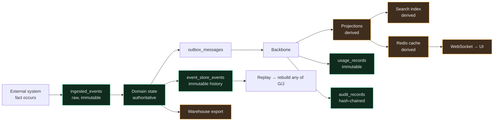

# Data Flow & Lineage (Level 4)

> Where a fact comes from, everywhere it ends up, and which copies can be wrong.
> Answers the brief's data-lineage requirement for the platform's most important entity.

---

## Lineage of one fact: "order 8500 was flagged"

**Green is authoritative. Amber is derived.** Amber can be deleted and rebuilt; green cannot. If you can't say
which colour a store is, you don't yet know what happens when it's wrong.

| Stage | Store | Class | Can it be wrong? | Fix |
|-------|-------|-------|------------------|-----|
| Raw capture | `ingested_events` | Authoritative | Only if the provider lied | Nothing to fix locally |
| Domain state | context tables | Authoritative | Only via a bug | Compensating command + audit |
| History | `event_store_events` | Authoritative, append-only | Immutable | Compensating event ([ADR-005](../11-decisions/ADR-005-event-sourcing.md)) |
| Read models | projections | Derived | **Yes** | Rebuild from history |
| Search / vectors | index | Derived | **Yes** | Reindex |
| Cache | Redis | Derived | **Yes** | Invalidate |
| Metering | `usage_records` | Authoritative, append-only | Only via a bug | Correcting record, never an update |
| Audit | `audit_records` | Authoritative, hash-chained | Tamper-evident | Cannot be corrected — only appended to |

---

## Transformations, and what each can lose

| Transformation | Input → output | Loses | Recoverable from |
|----------------|----------------|-------|------------------|
| Webhook → ingested event | Provider JSON → envelope + raw payload | Nothing (raw is kept) | — |
| Ingested → domain command | Raw → validated, typed | Fields we don't model | `ingested_events` |
| Command → domain event | Intent → fact | Rejected intents (recorded separately) | — |
| Event → projection | Fact → shaped row | Everything not projected | Replay |
| Chunk → embedding | Text → vector | Everything (lossy by nature) | Re-embed from the chunk |
| Usage → rollup | Records → aggregate | Per-record detail | Re-aggregate |

The embedding row matters most: an embedding is **not** a copy you can read back. It is derived, lossy, and
model-versioned — which is why the source chunk is retained and the namespace records its model
([ADR-008](../11-decisions/ADR-008-vector-database.md)).

---

## Where inconsistency is possible — and the honest window

| Pair | Can diverge? | Window | Detected by |
|------|-------------|--------|-------------|
| Domain state ↔ its own events | **No** — same transaction | — | Would be a bug in the store |
| Domain state ↔ outbox | **No** — same transaction | — | INV-04 |
| Outbox ↔ backbone | Yes (not yet published) | Relay lag | `outbox_oldest_age` |
| Backbone ↔ projection | Yes | Projection lag budget | Lag SLI |
| Projection ↔ truth | Yes (**wrong**, not late) | Unbounded until detected | **Reconciliation only** |
| Cache ↔ projection | Yes | TTL | Version-keyed invalidation |
| Search ↔ documents | Yes | Index lag | Indexing lag metric |
| Audit ↔ action | **No** — same transaction | — | Chain verification |

The fifth row is the dangerous one. Lag is visible and self-resolving; **wrongness is invisible and permanent**
until something compares derived state against source state. That is why
[ADR-010](../11-decisions/ADR-010-consistency-model.md) Rule 3 makes scheduled reconciliation mandatory rather
than optional — a system that only *believes* it converges will diverge silently for months.

---

## Data at rest

| Data | Location | Protection |
|------|----------|------------|
| Business rows | PostgreSQL | Storage encryption + RLS + least-privilege DB roles |
| Credentials | `encrypted_credentials` | Envelope encryption; plaintext only in memory at point of use (INV-18) |
| Personal data in events | Event payload | Per-subject key envelope → enables crypto-shredding (NFR-602) |
| Documents | Object storage | Server-side encryption; tenant-prefixed keys |
| Embeddings | PostgreSQL | Treated as derived **personal data**, same retention as the source |
| Telemetry | External backend | Redacted at the boundary before export |

Personal data inside event payloads is encrypted with a per-subject key **at write time**, not at erasure time.
Retrofitting that is impossible: an append-only log written in plaintext cannot later be made erasable.

---

## Retention

| Data | Hot | Archive | Then |
|------|-----|---------|------|
| `ingested_events` | 90 d | 1 y cold | Purge (raw payloads are the largest PII surface) |
| `event_store_events` | Indefinite | Partition rotation | Crypto-shred on erasure request |
| Projections | Live | — | Rebuildable, so no retention concern |
| `usage_records` | 13 mo | 7 y | Billing dispute window |
| `audit_records` | 13 mo | 7 y | Compliance |
| Documents | Tenant-configured | — | Delete + reindex |

## Related

[Event flow](event-flow.md) · [Request flow](request-flow.md) ·
[ADR-010](../11-decisions/ADR-010-consistency-model.md) · [Failure domains](failure-domains.md)
