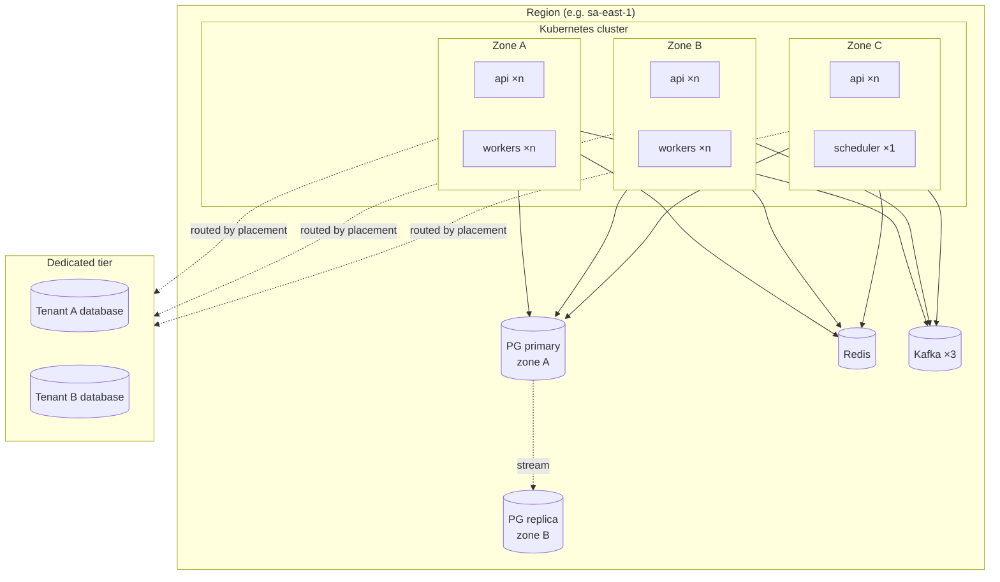
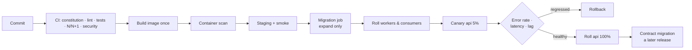

# Deployment Architecture

> How the [containers](container-diagram.md) are actually deployed, scaled, and released.
>
> Status: **designed, not yet built** — Kubernetes manifests are Phase 14. See [project-state](../00-start-here/project-state.md).

---

## Regional topology

Every stateless role spreads across zones with anti-affinity. Losing a zone costs ~⅓ capacity and, if it held
the primary, triggers replica promotion.

The dedicated-tier databases are separate failure domains by construction — that is what those tenants are
paying for ([ADR-009](../11-decisions/ADR-009-multi-tenancy.md)).

---

## Autoscaling

Each role scales on the signal that actually reflects its backlog, not on CPU. CPU is a poor proxy for a role
that spends its life waiting on a model provider.

| Role | Signal | Why not CPU |
|------|--------|-------------|
| `api` | Requests/sec + p95 latency | CPU lags user-visible pain |
| `ingest` | Webhook rate | Same |
| `relay` | **Age of oldest unpublished row** | Depth can be small while the oldest row is 10 minutes stale — the failure is silent |
| `consumer` | Consumer lag (seconds) | |
| `projector` | Projection lag (seconds) | |
| `worker:*` | Queue depth per queue | |
| `worker:agents` | In-flight executions vs. concurrency cap | Threads are blocked on I/O, so CPU stays near zero while saturated |
| `scheduler` | — | Singleton |

Scale-down is deliberately slower than scale-up (workers must drain leases), and every role has a floor ≥ 2
except the scheduler — a role at zero replicas has no way to notice it is needed.

---

## Release strategy

Three properties make this safe:

1. **One image**, built once. Roles differ only by `NEXUS_ROLE`, so "the worker is running a different build"
   is impossible.
2. **Migrations are a job**, never an app-boot side effect. N pods racing to migrate is a data-corruption story.
3. **Expand and contract are different releases.** The contract migration ships only after every running pod
   is on a version that no longer uses the dropped column (INV-11). This is the discipline the N/N+1 CI job
   verifies mechanically.

Workers roll before `api` because they are idempotent and resumable: a worker killed mid-step retries safely,
whereas an in-flight HTTP request does not.

## Rollback criteria

Automatic rollback if, during canary:

| Signal | Threshold |
|--------|-----------|
| 5xx rate | > 2× baseline for 2 min |
| p95 latency | > 1.5× baseline for 5 min |
| Consumer lag | Growing monotonically for 5 min |
| Stuck-run count | Any increase |
| Cross-tenant assertion failures | **Any** — immediate |

Rollback is a re-deploy of the previous image. It is safe **only** because the schema is still compatible —
which is the entire reason for expand/contract. A release that has already contracted cannot be rolled back
by redeploying, and that is stated in the runbook rather than discovered.

---

## Configuration & secrets

| Kind | Mechanism |
|------|-----------|
| Non-secret config | ConfigMap → environment; documented in `.env.example` |
| Secrets | External secret store → mounted; never baked into images (INV-18) |
| Provider credentials | Rotated without redeploy; short-lived where the provider allows |
| DB credentials | Per-role database users with least privilege — the `api` role cannot run DDL |

## Resource envelopes (initial, to be measured)

| Role | CPU req/lim | Memory req/lim |
|------|-------------|----------------|
| `api` | 500m / 2 | 512Mi / 1Gi |
| `ingest` | 250m / 1 | 256Mi / 512Mi |
| `relay` / `consumer` / `projector` | 250m / 1 | 512Mi / 1Gi |
| `worker:default` | 500m / 2 | 512Mi / 1Gi |
| `worker:agents` | 250m / 1 | 512Mi / 1Gi |
| `worker:documents` | 1 / 4 | 2Gi / 4Gi |
| `scheduler` | 100m / 500m | 256Mi / 512Mi |

`worker:agents` gets low CPU and high thread count because it is I/O-bound; `worker:documents` gets the
opposite because it parses hostile input in memory. Sizing a role wrong here is the fastest way to waste
half the cluster.

## Related

[Container diagram](container-diagram.md) · [Failure domains](failure-domains.md) ·
[Kubernetes](../07-infrastructure/kubernetes.md) · [Deployment runbook](../12-operations/deployment.md)
