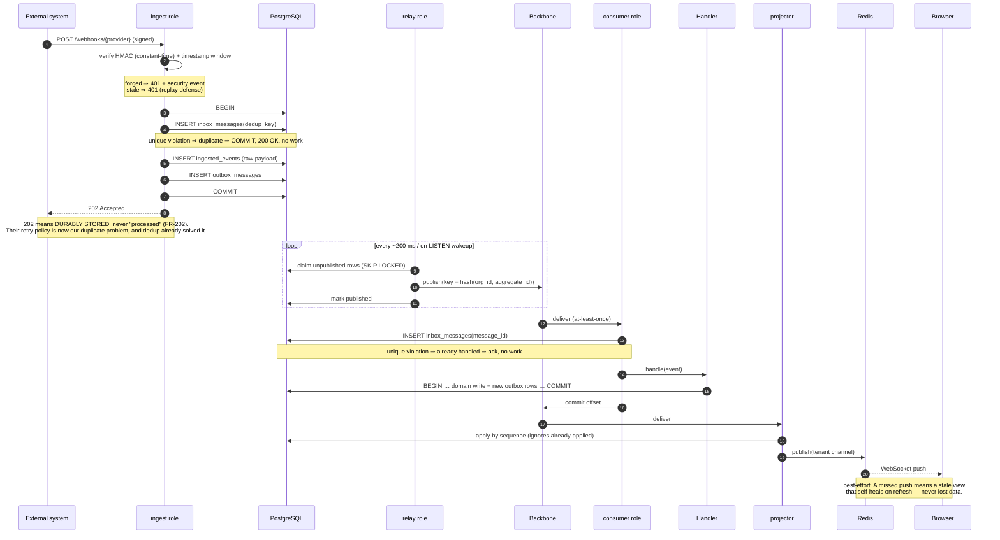

# Event Flow (Level 4)

> From "something happened outside" to "the UI updated", with every durability boundary marked.
> The companion synchronous view is [request flow](request-flow.md).

---

## End to end



---

## The four durability boundaries

Everything else is detail; these four are the design:

| # | Boundary | Guarantee | If it broke |
|---|----------|-----------|-------------|
| 1 | Webhook → `COMMIT` | The fact survives our crash | We'd lose events on restart and blame the provider |
| 2 | Domain write + outbox in **one** transaction | State and its event cannot disagree | Commit-then-crash silently desynchronizes everything downstream (INV-04) |
| 3 | Inbox dedup on unique constraint | Redelivery is a no-op | At-least-once delivery would corrupt state (INV-05) |
| 4 | Projection apply-by-sequence | Out-of-order and duplicate applies are safe | Rebuilds and redeliveries would corrupt read models |

## Why the outbox, concretely

The failure it prevents is boring and fatal:

```
BEGIN; UPDATE order SET status='flagged'; COMMIT;
  ← process dies here
publish(OrderFlagged)     ← never happens
```

The order is flagged. Nothing downstream knows. No error was raised, no alert fired, and the inconsistency is
invisible until someone asks why the notification never arrived — usually weeks later.

With the outbox, the event row commits **with** the status change. The relay is then free to crash, restart, or
publish twice: duplicates are handled by boundary 3.

## Ordering

Partition key is `hash(organization_id, aggregate_id)`, which buys:

- events for one aggregate are ordered (FR-205);
- one tenant's traffic spreads across partitions rather than pinning to one;
- no global ordering is implied, because none exists
  ([INV-09](architecture-constitution.md#inv-09--ordering-is-per-key-never-global)).

Handlers must therefore tolerate: events for *different* aggregates arriving in any order, and the same event
arriving twice.

## Latency budget (NFR-103: ingest → first consumer < 1 s p95)

| Segment | Budget |
|---------|--------|
| Ingest (verify + store + ack) | 50 ms |
| Outbox → relay pickup | 200 ms |
| Publish | 50 ms |
| Broker → consumer | 100 ms |
| Handler | 200 ms |
| **Total** | **~600 ms** |

The relay's pickup interval is the largest term and the easiest regression: `LISTEN/NOTIFY` wakeups keep it
near-zero under load, and polling is the floor when idle.

## Failure behavior

| Failure | Effect | Recovery |
|---------|--------|----------|
| Broker down | Outbox grows; **no loss** | Relay drains on recovery; alert on outbox *age* |
| Relay down | Same | Restart; work is a queue, not state |
| Consumer down | Lag grows | Restart from committed offset |
| Poison message | One partition stalls | Bounded retries → DLQ with context → advance offset |
| Handler crashes mid-work | Offset not committed → redelivery | Inbox dedup makes the retry safe |
| Projector wrong (not late) | Wrong read models | Fix, rebuild into a shadow table, atomic swap |

Full matrix: [failure domains](failure-domains.md).

## Related

[ADR-003](../11-decisions/ADR-003-event-bus.md) · [Request flow](request-flow.md) · [Data flow](data-flow.md)
