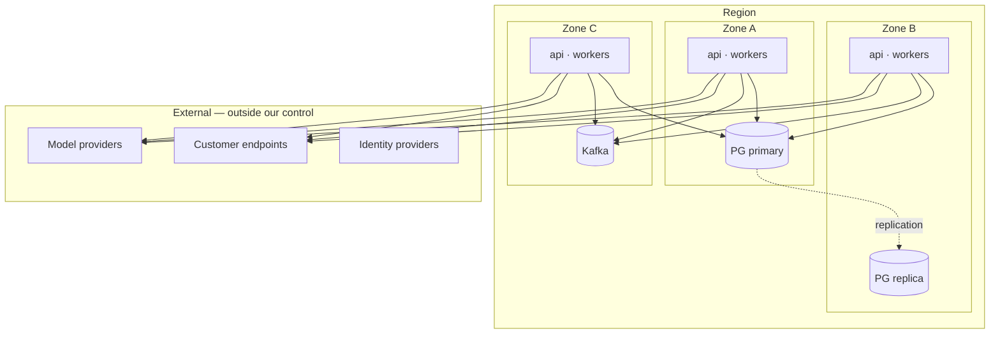

# Failure Domains & Failure Matrix

> For every dependency: what happens if it disappears, if it gets slow, if it returns garbage, if it delivers
> the same message twice, and if we crash halfway through using it.
>
> This document is the input to [chaos engineering](../12-operations/chaos-engineering.md) — every row's
> "expected behavior" is a hypothesis, and each hypothesis has a test.

---

## Failure domains

A failure domain is a set of components that fail together. Designing means *choosing* these boundaries rather
than discovering them during an incident.

| Domain | Blast radius | Contained by |
|--------|-------------|--------------|
| Single pod | One role's capacity | Replicas ≥ 2 per role; leases make in-flight work reclaimable |
| Availability zone | ~⅓ capacity; possibly the primary | Multi-AZ spread; automated primary failover |
| PostgreSQL primary | **All writes, all tenants in that pool** | Replica promotion; PITR; dedicated tier is a separate domain |
| Redis | Cache, rate limits, real-time push | INV-08: degraded performance only, never data loss |
| Kafka | Event propagation (not ingestion) | Outbox absorbs the backlog; no data loss |
| One tenant's workload | That tenant | Fair dispatch, quotas, concurrency caps (NFR-403) |
| One model provider | AI decisions | Tier + provider fallback; `awaiting_capacity` parking |
| One customer endpoint | That tenant's deliveries | Per-endpoint circuit breaker |
| Region | Everything in it | Multi-region failover ([DR](../07-infrastructure/disaster-recovery.md)) |
| A bad deploy | All roles unless staged | Canary; expand/contract migrations (INV-11); staged role rollout |

**The one shared-fate boundary we accept:** the pool-tier PostgreSQL primary. It is the deliberate cost of
[ADR-009](../11-decisions/ADR-009-multi-tenancy.md)'s economics, and it is why the dedicated tier exists for
tenants that cannot accept it.

---

## Failure matrix

| # | Component | Failure | Detection | Impact | Recovery | Data loss | User impact | Observability | Test |
|---|-----------|---------|-----------|--------|----------|-----------|-------------|---------------|------|
| 1 | PostgreSQL primary | Unavailable | Health check, conn errors | Writes fail platform-wide (pool tier) | Automated replica promotion (< 2 min) | ≤ replication lag (target < 5 s) | Errors, then recovery; workflows resume from durable state | `db_up`, `replication_lag_bytes` | `chaos/db-primary-kill` |
| 2 | PostgreSQL primary | Slow (p99 ↑10×) | Query latency, pool saturation | Cascading timeouts | Statement timeouts shed load; circuit-break non-critical reads | None | Degraded latency | `db_query_duration`, `pool_saturation` | `chaos/db-latency-inject` |
| 3 | PostgreSQL | Returns corrupt/inconsistent data | Checksums, reconciliation, constraint violations | Wrong business outcomes | PITR to pre-corruption; replay projections | Potentially, bounded by PITR | Severe; incident | `reconciliation_divergence` | `chaos/corrupt-projection` |
| 4 | Redis | Unavailable | Conn errors | Cache misses, rate limiting degraded, no live push | Fail-open for cache, **fail-closed for rate limits**, WS falls back to polling | **None** (INV-08) | Slower UI, no live updates | `redis_up`, `cache_hit_ratio` | `chaos/redis-kill` |
| 5 | Redis | Stale/incorrect cached value | TTL, versioned keys | Stale reads | Key versioning; targeted invalidation | None | Brief stale display | `cache_staleness` | `chaos/redis-stale` |
| 6 | Kafka | Unavailable | Producer errors, relay lag | Events queue in outbox | Relay resumes; consumers catch up | **None** | Delayed automation | `outbox_oldest_age`, `consumer_lag` | `chaos/broker-kill` |
| 7 | Kafka | Duplicate delivery | Inbox conflict counter | **None by design** | Idempotent handlers (INV-05) | None | None | `inbox_duplicate_total` | `chaos/duplicate-delivery` |
| 8 | Kafka | Delayed delivery (minutes) | Consumer lag | Late automation | Ordering per key preserved; handlers tolerate lateness | None | Delayed | `consumer_lag_seconds` | `chaos/delayed-delivery` |
| 9 | Kafka | Poison message | Consumer error rate on one partition | Partition stalls | Bounded retries → DLQ → advance offset | None (quarantined) | That tenant's events delayed | `dlq_depth` | `chaos/poison-message` |
| 10 | Worker | Crash mid-step | Lease expiry | Step retried | Reclaim after lease TTL (< 30 s, NFR-105) | None | Slight delay | `lease_reclaim_total`, `stuck_runs` | `chaos/worker-kill-mid-step` |
| 11 | Worker | Crash **after** external call, **before** recording | Idempotency-key collision on retry | Duplicate external effect risk | Idempotency key derived from `(run, step, attempt)`; provider dedups | None | None if provider honors keys; otherwise compensation | `idempotent_replay_total` | `chaos/kill-after-side-effect` |
| 12 | Relay | Stops publishing | `outbox_oldest_age` | Growing propagation delay | Scale relay; alert at 30 s | None | Delayed automation | `outbox_depth` | `chaos/relay-stop` |
| 13 | Projector | Crash / lag | Projection lag SLI | Stale reads | Restart from committed offset | None (derived) | Stale dashboards with visible badge | `projection_lag_seconds` | `chaos/projector-stop` |
| 14 | Projector | Wrong logic shipped | Reconciliation divergence | Wrong dashboards | Fix + shadow rebuild + atomic swap | None (source intact) | Temporarily wrong displays | `reconciliation_divergence` | `chaos/bad-projector` |
| 15 | Model provider | Unavailable | Error rate, breaker open | No AI decisions on that tier | Tier → provider fallback; then `awaiting_capacity` | None | Automation pauses, does not fail | `ai_provider_errors`, `breaker_state` | `chaos/ai-provider-down` |
| 16 | Model provider | Slow (30 s+) | Latency p99 | Agent steps slow; workers occupied | Per-call timeout; concurrency caps prevent starvation | None | Delayed decisions | `ai_latency_p99` | `chaos/ai-provider-slow` |
| 17 | Model provider | Refusal (`stop_reason: refusal`) | Refusal counter by category | That decision blocked | Fallback model; else escalate to human | None | Human takes over | `ai_refusal_total` | `contract/ai-refusal` |
| 18 | Model provider | Returns manipulated/injected output | Tool authorization denials; injection heuristics | Attempted unauthorized action | Structural framing + tool authorization (INV-19/20) | None | None | `tool_denial_total` | `security/prompt-injection-corpus` |
| 19 | Customer endpoint | 500 for hours | Endpoint health | That tenant's deliveries backlog | Circuit break; exponential backoff; DLQ; endpoint marked unhealthy | None | That tenant only (NFR-403) | `endpoint_health`, `delivery_failures` | `chaos/endpoint-500` |
| 20 | Customer endpoint | Timeout | Delivery latency | Worker occupied | Aggressive timeout + bounded concurrency per endpoint | None | That tenant only | `delivery_duration` | `chaos/endpoint-timeout` |
| 21 | Inbound webhook | Duplicate | Inbox unique violation | **None** | Dedup key (FR-201) | None | None | `webhook_duplicate_total` | `test/webhook-duplicate` |
| 22 | Inbound webhook | Forged | Signature failure | Rejected | 401 + security event | None | None | `webhook_signature_failures` | `security/webhook-forgery` |
| 23 | Inbound webhook | Replayed (old, valid signature) | Timestamp window | Rejected | Freshness window + nonce | None | None | `webhook_replay_rejected` | `security/webhook-replay` |
| 24 | Inbound webhook | Malformed | Schema validation | Rejected, stored raw | 400; raw payload retained for diagnosis | None | None | `webhook_malformed_total` | `test/webhook-malformed` |
| 25 | Object storage | Unavailable | Error rate | Document ingest/download fails | Retry with backoff; documents stay `pending` | None | Uploads fail visibly | `storage_errors` | `chaos/storage-down` |
| 26 | Identity provider (SSO) | Unavailable | Auth error rate | Enterprise users cannot log in | Existing sessions continue; break-glass local admin path | None | Login outage for SSO tenants | `sso_errors` | `chaos/idp-down` |
| 27 | Scheduler | Crash | Missed-tick alert | Timers not fired | Leader re-election; **due-time query catches up all missed timers** | None | Delayed wakeups | `scheduler_tick_lag` | `chaos/scheduler-kill` |
| 28 | Clock | Skew across nodes | Skew metric | Premature/late lease expiry | Lease expiry evaluated by the **database clock** | None | None | `clock_skew_seconds` | `chaos/clock-skew` |
| 29 | Deploy | Backward-incompatible schema | Post-migration verification; N/N+1 test | Old pods error | Expand/contract (INV-11); rollback | None if discipline held | Brief errors | `deploy_error_rate` | `ci/n-n1-compat` |
| 30 | Deploy | Bad code, no schema change | Canary error rate | Errors on canary only | Automatic rollback | None | Small % of requests | `canary_error_rate` | `ci/canary-rollback` |
| 31 | Agent | Runaway loop | Step/token/cost counters | Cost burn | Hard ceilings terminate (INV-22) | None | Run fails with a clear reason | `agent_ceiling_hits` | `chaos/runaway-agent` |
| 32 | Tenant | Traffic spike 50× | Per-tenant throughput | Others could starve | Fair dispatch + rate limits + concurrency caps | None | That tenant throttled | `tenant_throughput`, `throttle_total` | `chaos/noisy-neighbor` |
| 33 | Region | Total loss | Multi-region health | Region's tenants offline | Failover per [DR](../07-infrastructure/disaster-recovery.md) | ≤ RPO (5 min) | Outage until failover (RTO 15 min) | `region_health` | `dr/region-failover-drill` |

---

## Cross-cutting rules the matrix encodes

1. **Ingestion never depends on processing.** Rows 6, 8, 12: the broker can be down and we still accept and
   durably store webhooks. This is why FR-202 says the 2xx means "stored", not "processed".
2. **Derived data failures are never data loss.** Rows 13, 14: projections, caches, and indexes are rebuildable
   by construction, so their failure mode is *staleness or wrongness*, never *loss*.
3. **External slowness is contained, not absorbed.** Rows 16, 19, 20: timeouts and breakers convert an
   unbounded dependency into a bounded one.
4. **Crash-after-effect is the hardest case and is designed for explicitly.** Row 11 is the failure most
   systems get wrong; idempotency keys derived from durable identifiers are the mitigation.
5. **Time is not a coordination primitive.** Row 28: the database's clock is authoritative for leases.
6. **AI failures degrade to humans, never to silent wrong answers.** Rows 15–18.

## Untested claims

Any row whose test column names a scenario not yet implemented is tracked in
[project-state.md](../00-start-here/project-state.md) and [technical-debt.md](../technical-debt.md).
**A documented recovery behavior that has never been executed is a hypothesis, and this document labels it as
one rather than presenting it as a guarantee.**
