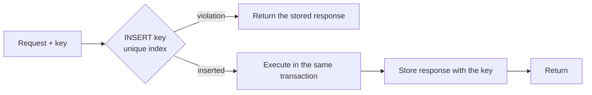

# Request Flow (Level 4)

> What happens between an HTTP request arriving and a response leaving. The security- and
> consistency-critical steps are marked; skipping any of them is a defect, not an optimization.

---

## The synchronous path

```mermaid
sequenceDiagram
    autonumber
    participant C as Client
    participant GW as Ingress / WAF
    participant API as api role
    participant ID as Identity
    participant ORG as Organizations
    participant AZ as Authorization
    participant D as Domain command
    participant PG as PostgreSQL

    C->>GW: HTTPS request (+ bearer token, idempotency key)
    GW->>GW: TLS, WAF, coarse rate limit
    GW->>API: forward (+ trace context)

    API->>API: start span · assign correlation_id
    API->>ID: verify token (signature, expiry, audience)
    ID-->>API: principal (user | service | agent)
    Note over API,ID: invalid ⇒ 401. Never a partial identity.

    API->>ORG: resolve organization + placement
    ORG-->>API: tenant context
    API->>PG: open connection for placement; SET nexus.organization_id
    Note over API,PG: absent tenant ⇒ raise (INV-14 layer c).<br/>Session var and connection are cross-checked.

    API->>AZ: authorize(principal, action, resource)
    AZ-->>API: allow | deny
    Note over API,AZ: strongly consistent read, never a projection<br/>(ADR-010 Rule 1). No grant ⇒ deny.

    API->>API: validate payload (schema)
    API->>D: execute command

    D->>PG: BEGIN
    D->>PG: domain write
    D->>PG: outbox row (same txn — INV-04)
    D->>PG: audit record (same txn — never async)
    D->>PG: COMMIT

    D-->>API: result
    API-->>C: 2xx + the command's own result
    Note over API,C: read-your-writes with zero coordination<br/>(no "poll until it appears")
```

---

## The ordering is not arbitrary

Each step depends on the previous one having *failed closed*:

| Step | Must come before | Why |
|------|------------------|-----|
| Authenticate | Tenant resolution | You cannot resolve a tenant for an unknown principal |
| Resolve tenant | Any data access | A query without tenant context could touch any tenant's rows |
| Set session variable | Any query | RLS reads it; unset means RLS denies everything (fail closed) |
| Authorize | Command execution | Authorizing after a side effect is not authorization |
| Validate | Command execution | Domain logic must never receive unvalidated input |

A reordering that "saves a round trip" by authorizing after loading the resource is the classic
insecure-direct-object-reference bug: you have already read the row you were not allowed to read.

---

## Idempotent writes

Mutating endpoints accept an `Idempotency-Key`:



The **unique constraint is the mechanism**, not a lookup-then-insert. A check followed by an insert is a race;
a unique violation is a decision. Same reasoning as inbox dedup
([INV-05](architecture-constitution.md#inv-05--every-distributed-operation-is-idempotent)).

---

## Error responses

| Condition | Status | Body carries | Notes |
|-----------|--------|--------------|-------|
| No/invalid token | 401 | correlation_id | Never reveals whether the resource exists |
| Authorized but forbidden | 403 | correlation_id | |
| Not found *or* not yours | **404** | correlation_id | Deliberately indistinguishable — a 403 for another tenant's ID confirms it exists |
| Validation failure | 422 | field errors | |
| Rate limited | 429 | `Retry-After` | Per tenant + endpoint |
| Idempotency key reused with a different body | 409 | | Reuse must mean "same request" |
| Tenant context missing | 500 + alert | correlation_id | A bug, not a user error — fail loudly |
| Downstream unavailable | 503 | `Retry-After` | Never a partial success |

The 404-instead-of-403 rule is a real cross-tenant leak vector: `GET /workflows/{uuid}` returning 403 for a
valid other-tenant UUID and 404 otherwise is an enumeration oracle.

---

## Latency budget (NFR-101: p95 < 150 ms)

| Segment | Budget | Notes |
|---------|--------|-------|
| Ingress + TLS | 10 ms | |
| Auth (token verify) | 5 ms | Local verification; no network call |
| Tenant resolution | 5 ms | Cached with post-connect verification |
| Authorization | 10 ms | Strongly consistent, in-request cache only |
| Validation | 2 ms | |
| Domain + transaction | 60 ms | The real work |
| Serialization | 8 ms | |
| **Total** | **~100 ms** | 50 ms headroom |

Authorization gets a real budget rather than a cache because
[ADR-010](../11-decisions/ADR-010-consistency-model.md) forbids caching it beyond a request — a revoked
permission honored for 200 ms is a vulnerability, not a latency win.

---

## Related

[Event flow](event-flow.md) · [Data flow](data-flow.md) ·
[Consistency model](../11-decisions/ADR-010-consistency-model.md) ·
[Tenant isolation](../08-security/tenant-isolation.md)
