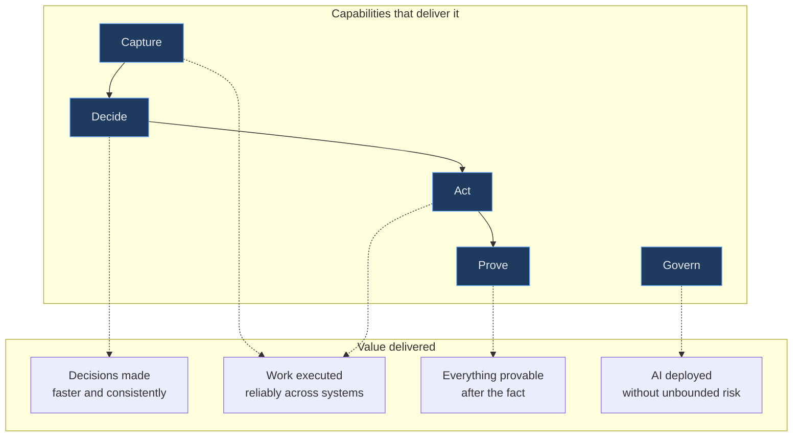
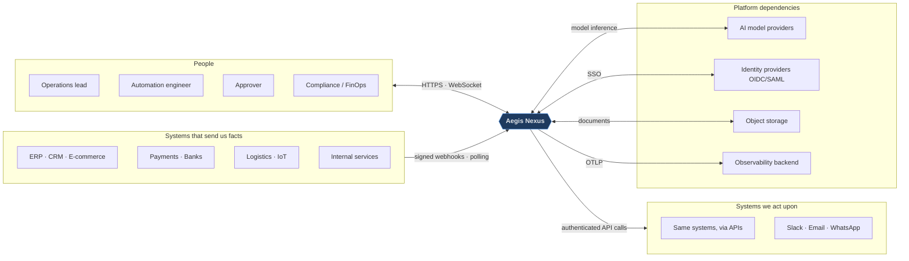
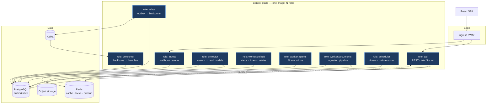

# System Overview

> The navigation spine of the architecture documentation. Six abstraction levels, each answering a different
> question, each linking down to the next. A developer should be able to descend from "what does the business
> do" to "which file" without ever guessing.

---

## Abstraction levels

| Level | Question it answers | Where |
|-------|--------------------|-------|
| **0 — Business** | What capabilities does the company sell? | [below](#level-0--business-architecture) · [business domains](../01-product/business-domains.md) |
| **1 — System context** | What is inside the system, what is outside, who talks to it? | [below](#level-1--system-context) |
| **2 — Containers** | What deployable units exist and why? | [below](#level-2--containers) · [container diagram](container-diagram.md) |
| **3 — Components** | What is inside a container? | [component diagram](component-diagram.md) |
| **4 — Runtime** | What actually happens when something occurs? | [request flow](request-flow.md) · [event flow](event-flow.md) · [data flow](data-flow.md) |
| **5 — Code** | Which directory, which file? | [codebase navigation](../00-start-here/codebase-navigation.md) |

---

## Level 0 — Business architecture



| Capability | Means | Bounded contexts |
|-----------|-------|------------------|
| **Capture** | Ingest what happened, durably, exactly once in effect | Integrations, Events |
| **Decide** | Apply policy, rules, and AI judgment within limits | Workflows, Agents, Documents |
| **Act** | Execute across systems with retries and compensation | Workflows, Integrations, Notifications |
| **Prove** | Reconstruct any decision and its inputs | Audit, Events |
| **Govern** | Enforce identity, permission, budget, and residency | Identity, Organizations, Authorization, Billing |

---

## Level 1 — System context



**Trust posture toward each edge** — the single most important thing to understand at this level:

| Edge | Trusted? | Consequence in the design |
|------|----------|---------------------------|
| Inbound webhooks | **No** | Signature + timestamp + idempotency before anything else (FR-201) |
| Uploaded documents | **No — actively hostile** | Malware scan, sanitization, and untrusted-content framing (FR-504, INV-19) |
| Model provider output | **No** | Data, never instruction (INV-19); tool proposals are authorized before execution (INV-20) |
| Downstream systems | **No** | Timeouts, circuit breakers, compensations; their slowness is not our outage |
| Internal services | **No** | Zero trust (INV-17) — network position is not a credential |
| Human users | **Authenticated, not trusted** | Deny-by-default authorization on every action (INV-15) |

---

## Level 2 — Containers

One image, several roles ([ADR-001](../11-decisions/ADR-001-architecture-style.md)). "Container" here means
*deployable unit*, not "Docker image".



| Role | Scaling driver | Why it is separate |
|------|---------------|--------------------|
| `api` | Request rate | Latency-critical; must not share a process with batch work |
| `ingest` | Webhook rate | Extreme rate, trivial work; isolated so a webhook storm cannot slow the API |
| `relay` | Outbox depth | Must keep publishing during load spikes; starving it silently delays everything downstream |
| `consumer` | Backbone lag | Scales with partition count |
| `projector` | Event volume | Isolated so a slow rebuild never touches the write path |
| `worker:default` | Queue depth | General step execution |
| `worker:agents` | Concurrency | Latency-bound on providers, not CPU-bound — needs a different concurrency model |
| `worker:documents` | Queue depth | Memory- and CPU-heavy; hostile input; a pre-authorized extraction candidate |
| `scheduler` | Fixed (leader-elected) | Singleton semantics; must not scale horizontally |

---

## Level 3 — Components

See [component diagram](component-diagram.md). Summary of the layering inside the control plane:

```
app/
├── interfaces/          HTTP controllers, WebSocket channels, webhook receivers, serializers
├── domains/             One directory per bounded context (INV-01/INV-02)
│   └── <context>/
│       ├── *.rb         PUBLIC contract — commands, queries, events
│       └── internal/    PRIVATE — aggregates, services, projections, adapters
└── infrastructure/      Cross-cutting mechanisms owned by no domain:
                         tenancy, event_store, events (outbox/inbox/transport),
                         jobs, projections, authorization plumbing, telemetry, cache
```

The `interfaces` layer never contains business logic; the `infrastructure` layer never contains domain
vocabulary. Both rules are checkable and are checked.

---

## Level 4 — Runtime behavior

| Scenario | Diagram |
|----------|---------|
| A request enters and is authorized | [request flow](request-flow.md) |
| An event travels from webhook to UI | [event flow](event-flow.md) |
| A workflow executes, suspends, and resumes | [workflow runtime](../03-domains/workflows/runtime.md) |
| An agent decides and calls tools | [agent runtime](../05-ai/agent-runtime.md) |
| A document becomes retrievable | [RAG](../05-ai/rag.md) |
| Something fails and recovers | [failure recovery](../04-distributed-systems/failure-recovery.md) |

The canonical UC-01 scenario is traced end-to-end in [use cases](../01-product/use-cases.md#uc-01--high-value-order-requires-governed-decisioning-canonical).

---

## Level 5 — Code

[Codebase navigation](../00-start-here/codebase-navigation.md) maps every subsystem to its entry point, public
API, internal components, tables, events emitted and consumed, jobs, and tests.

---

## The five properties everything is designed around

If you remember nothing else from this document:

1. **Nothing important lives only in memory.** Durable state or it did not happen (INV-07).
2. **Nothing important is written twice.** State and its event commit together (INV-04).
3. **Nothing important happens without a tenant.** Missing tenant context fails closed (INV-14).
4. **Nothing important happens without authorization.** Including — especially — when an AI asked for it (INV-15, INV-20).
5. **Nothing important is unexplainable afterwards.** Trace it, audit it, replay it (INV-21, INV-23).
