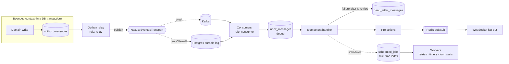

# ADR-003 — Event Backbone: Kafka for the Log, a Durable Job Queue for Scheduling, behind One Transport Port

| | |
|---|---|
| **Status** | Accepted |
| **Date** | 2026-08-09 |
| **Deciders** | Staff Distributed Systems, SRE, Principal Architect |
| **Supersedes** | — |

---

## Context

"Which message broker?" is the wrong first question. The right first question is **which distinct messaging
problems do we actually have?** Aegis Nexus has three, and they have incompatible optimal solutions:

| Problem | Characteristics | What it needs |
|---------|----------------|---------------|
| **1. The event log** — facts published by contexts, consumed by many independent subscribers | High volume, fan-out, must be replayable months later (FR-208), per-key ordering (FR-205) | Durable, retained, partitioned, offset-based, multi-subscriber |
| **2. Work scheduling** — "retry this step in 4 s with jitter", "wake this workflow in 14 days" (FR-303, FR-304) | Per-message delay, per-message retry, arbitrary scheduling horizon, cancellation | Per-message visibility timeouts, delayed delivery, indexed by due time |
| **3. Real-time push** — projection updated → notify connected browsers (FR-804, NFR-104) | Low latency, fan-out to ephemeral subscribers, loss-tolerant | Pub/sub, no durability needed |

Conflating (1) and (2) is the single most common mistake in event-driven architectures. A partitioned log is
excellent at (1) and *actively bad* at (2): delaying one message in a Kafka partition means either blocking
the partition (head-of-line blocking for every other key) or building retry-topic ladders whose delay
granularity is coarse and whose ordering guarantees are destroyed. Meanwhile a task queue is excellent at (2)
and cannot do (1) at all, because acknowledged messages are gone and cannot be replayed.

## Requirements driving this decision

FR-203 (at-least-once + idempotent consumers) · FR-204 (outbox) · FR-205 (per-key ordering) ·
FR-206 (DLQ + operator replay) · FR-207 (versioned schemas) · FR-208 (replay to rebuild projections) ·
FR-209 (correlation/causation) · FR-303, FR-304 (retries, long waits) · NFR-103 (< 1 s ingest→consumer) ·
NFR-402 (no global bottleneck) · NFR-403 (per-tenant isolation of work).

## Considered alternatives (for problem 1, the event log)

### A. Apache Kafka *(chosen for production)*

**Advantages**
- Retention-based storage means **replay is a first-class operation**, not a rebuild-from-backup exercise.
  FR-208 (rebuild any projection) is directly satisfied: reset the consumer group offset.
- Partitioning gives per-key ordering (FR-205) with horizontal consumer scaling — exactly the guarantee we
  promise and no stronger.
- Consumer groups let a new subscriber be added without touching producers, which is what keeps contexts
  decoupled (INV-03).
- Proven at volumes far beyond our modeled ceiling ([capacity planning](../10-performance/capacity-planning.md)).
- Mature schema-registry ecosystem supporting INV-10 compatibility enforcement.

**Disadvantages**
- Heavy operationally: brokers, controllers/ZooKeeper-or-KRaft, partition rebalancing, disk management.
  Managed offerings mitigate but do not eliminate this.
- Consumer group rebalances cause processing stalls (seconds) — must be designed around, not ignored.
- No per-message acknowledgement or redelivery: offsets are positional, so one poison message can block a
  partition. DLQ handling must be built by us.
- Bad at delayed/scheduled delivery (problem 2), as above.
- Per-tenant isolation is not native: a huge tenant can dominate a partition.

### B. RabbitMQ

**Advantages**
- Per-message acknowledgement, redelivery, dead-lettering, and priority — genuinely better than Kafka for
  problem 2 and for poison-message handling.
- Flexible routing topologies; smaller operational footprint at low scale.

**Disadvantages**
- **No replay.** Acknowledged messages are deleted. FR-208 would require an entirely separate archive plus
  bespoke rebuild tooling — reintroducing a second source of truth.
- Ordering degrades as soon as you have concurrent consumers on a queue.
- Deep queues are a memory-pressure and stability problem; backlog is the normal state during an incident.

### C. NATS JetStream

**Advantages**
- Streams with replay, low operational weight, excellent latency, good multi-tenancy primitives (accounts).
- Handles both durable streams and lightweight pub/sub — attractive for problems 1 *and* 3.

**Disadvantages**
- Smaller operational corpus for our failure scenarios; fewer engineers on the team have run it under stress.
- Long-horizon retention (months, for replay) is workable but less proven than Kafka's log-on-disk model.
- Ecosystem for schema compatibility enforcement is thinner.

> Honest note: NATS is the closest runner-up and would likely be the right choice for a smaller team. It is
> rejected on operational familiarity and replay-at-long-retention maturity, not on capability. This is
> recorded so a future team can revisit it without re-deriving the analysis.

### D. Redis Streams

**Advantages:** trivial to operate if Redis is already present; consumer groups; very low latency.
**Disadvantages:** durability is memory-first with best-effort persistence, and failover loses writes —
which directly violates [INV-08](../02-architecture/architecture-constitution.md#inv-08--redis-is-never-the-source-of-truth-for-durable-business-state).
Retention is bounded by RAM, so months-long replay is impossible. **Disqualified on durability**, not preference.

### E. PostgreSQL-backed durable log *(chosen as the reference/local/small-deployment implementation)*

A partitioned `events` table plus per-consumer-group offset tracking, polled with `FOR UPDATE SKIP LOCKED`.

**Advantages**
- Zero additional infrastructure; the entire platform runs on one dependency for local development, CI, and
  small single-region deployments.
- Replay is a `SELECT` with a lower offset bound — simpler than Kafka's, and directly queryable by operators.
- Atomic with the outbox: for small deployments the relay hop disappears entirely.

**Disadvantages**
- Throughput ceiling: realistically single-digit thousands of events/sec before the polling and vacuum load
  becomes the dominant cost. Adequate for development and small tenants, not for the modeled top end.
- Polling adds latency (mitigated by `LISTEN/NOTIFY` wakeups) and load proportional to consumer count.

## Considered alternatives (for problem 2, scheduling)

Kafka retry-topic ladders (coarse, ordering-destroying), external scheduler service (another dependency), or
a **database-backed durable job queue** with a due-time index and `SKIP LOCKED` claiming. The database queue
wins because workflow timers must be *transactional with workflow state* (INV-04/INV-07) and must support
cancellation, which broker-level delayed delivery does not.

## Decision

Three mechanisms, one abstraction where it helps and none where it hurts:

1. **Event log → Kafka in production**, behind a narrow transport port `Nexus::Events::Transport` whose
   contract is exactly the semantics we rely on and nothing more:
   `publish(topic, key, payload, headers)`, `subscribe(group, topics, handler)`, `commit(offset)`,
   `seek(group, topic, position)`. Implementations: `KafkaTransport` (production) and `PostgresLogTransport`
   (development, CI, small single-region deployments).
   **The port deliberately does not expose** transactions, compacted topics, or partition assignment control —
   if we ever need those, we change this ADR rather than leak Kafka into domain code.

2. **Scheduling and retries → PostgreSQL-backed durable job queue** (`scheduled_jobs`, due-time indexed,
   `SKIP LOCKED` claiming, per-tenant fair dispatch). Never Kafka.

3. **Real-time push → Redis pub/sub** feeding WebSocket fan-out. Loss-tolerant by design; the durable record
   is always in Postgres, so a missed push degrades to a stale UI that self-heals on refresh
   ([INV-08](../02-architecture/architecture-constitution.md#inv-08--redis-is-never-the-source-of-truth-for-durable-business-state)).

**Delivery semantics: at-least-once, with effectively-once processing via the inbox and idempotent handlers
(INV-05, INV-06). Exactly-once is never claimed.** Kafka's transactional producer is not used, because our
side effects (HTTP calls, model invocations) are outside Kafka's transaction boundary, so it would buy
partition-local atomicity while creating a false sense of end-to-end safety.

## Why

- **Replay is a hard requirement** (FR-208), and it eliminates RabbitMQ outright.
- **Durability is a constitutional requirement** (INV-08), and it eliminates Redis Streams outright.
- **Scheduling is a different problem**, and pretending otherwise produces retry-topic ladders that quietly
  destroy the ordering guarantee we promised in FR-205.
- **The transport port exists for testability and deployment flexibility, not for vendor neutrality theater.**
  Being able to run the entire platform — including full event flow, replay, and consumer groups — against a
  single PostgreSQL instance in CI is worth a great deal for the correctness testing this system requires.

## Consequences

- Domain code never imports a Kafka client. Only `KafkaTransport` does.
- The port's narrowness is load-bearing: adding a Kafka-only capability to the port requires amending this ADR.
- Every consumer declares a dedup key and is registered in the [event catalog](../13-reference/events.md).
- Consumers must tolerate rebalance-induced duplicate delivery — which INV-05 already requires.
- Two operational surfaces for "why is this not processing": consumer lag (Kafka) and job queue depth
  (Postgres). Both are on the [observability dashboard](../09-observability/metrics.md).

## Failure modes

| Failure mode | Detection | Impact | Mitigation |
|--------------|-----------|--------|------------|
| Broker unavailable | Producer error rate; relay lag | Events accumulate in the outbox — **no data loss** | Outbox is the buffer; relay resumes; alert on outbox depth/age |
| Consumer group rebalance storm | Rebalance rate metric; lag spikes | Processing stalls (seconds–minutes) | Static membership, tuned session timeouts, cooperative sticky assignor |
| Poison message blocks a partition | Consumer error rate; lag on one partition | One partition stalls | Bounded retries → DLQ with full context, then advance offset (FR-206) |
| Duplicate delivery | Inbox conflict counter | None (by design) | INV-05 idempotent handlers |
| Out-of-order across keys | N/A — not a failure | None | Documented as a non-guarantee (INV-09) |
| Hot partition (one huge tenant) | Per-partition lag; per-tenant throughput | That tenant's events delayed | Composite partition key `hash(org_id, aggregate_id)`; dedicated topics for dedicated-tier tenants |
| Relay falls behind | Outbox oldest-unpublished age | Increasing end-to-end latency | Scale relay role; batch publishing; alert on age > 30 s |
| Schema-incompatible producer deployed | CI compatibility check (pre-deploy) | Blocked before reaching production | INV-10 enforcement; consumers upcast (FR-207) |
| Kafka retention expires before replay is needed | Retention vs. oldest-needed-offset monitor | Replay impossible from Kafka | **The event store in Postgres is the authoritative replay source** — Kafka is transport, not archive |

> The last row is important and easy to get wrong: **Kafka is not our system of record.** The Postgres event
> store is. Kafka retention is a transport convenience; long-horizon replay reads from the event store and
> republishes. This is what keeps FR-208 true regardless of broker configuration.

## Operational impact

Adds managed Kafka (or MSK/Confluent) to the production dependency set, with consumer-lag alerting, partition
count planning, and rebalance tuning. Development and CI have **zero** additional dependencies, which
materially improves the test suite's ability to exercise event paths.

## Cost impact

Managed Kafka has a meaningful fixed monthly floor (multi-broker cluster + storage) that is disproportionate
at small scale — which is precisely why the Postgres transport exists for small single-region deployments.
Cost crossover is modeled in [capacity planning](../10-performance/capacity-planning.md).

## Security impact

- Broker requires TLS + SASL/mTLS authentication; per-role ACLs so a consumer role cannot produce (INV-17).
- **Payloads on the backbone contain tenant data**, so topic-level ACLs are not sufficient isolation; tenant
  scoping is re-verified by the consumer against the message's `organization_id` before any handler runs
  (part of INV-14's layer (c)).
- Message payloads exclude secrets (INV-18); credentials are referenced by ID, never embedded.

## Scalability impact

Partition count is the scaling unit and is hard to reduce later — sized in
[capacity planning](../10-performance/capacity-planning.md) with headroom. Per-tenant fairness is not native
and is implemented at the consumer via weighted dispatch (NFR-403).

## Related decisions

[ADR-002](ADR-002-database.md) (event store is authoritative) ·
[ADR-004](ADR-004-cqrs.md) (projections consume from here) ·
[ADR-005](ADR-005-event-sourcing.md) · [ADR-006](ADR-006-workflow-engine.md) (timers use the job queue) ·
[ADR-010](ADR-010-consistency-model.md)

## Related code

`apps/control-plane/infrastructure/events/transport/` ·
`infrastructure/events/outbox_relay.rb` · `infrastructure/events/consumer.rb` ·
`infrastructure/jobs/`

## Related diagrams

[Event flow](../02-architecture/event-flow.md) · [Outbox pattern](../04-distributed-systems/outbox-pattern.md)
