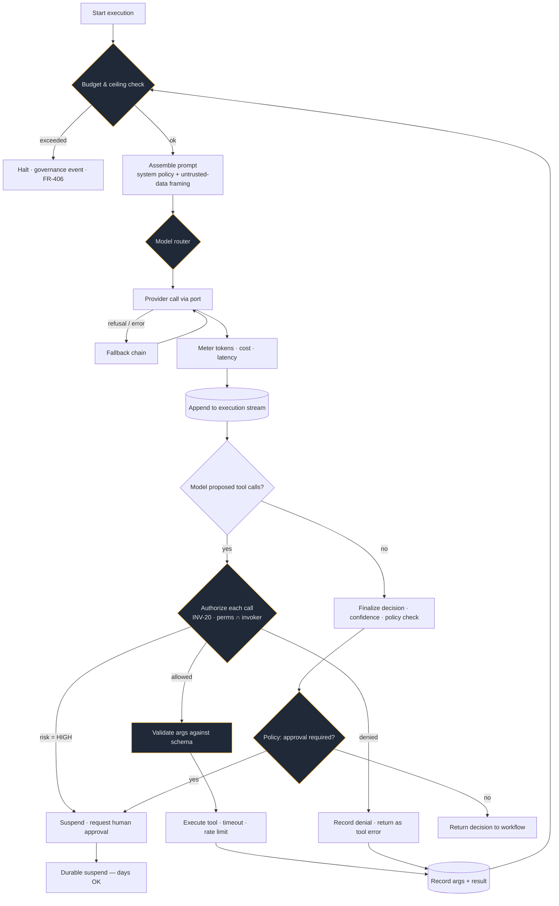

# ADR-007 — AI Runtime: Own the Agent Loop, Abstract the Provider

| | |
|---|---|
| **Status** | Accepted |
| **Date** | 2026-08-09 |
| **Deciders** | AI/LLM Systems Architect, Security Engineer, Principal Architect |
| **Supersedes** | — |

---

## Context

The platform must invoke language models to make operational decisions, inside hard limits, with a complete audit
record, on behalf of thousands of tenants with different budgets, privacy postures, and latency requirements.

Three decisions are entangled here and must be separated to be reasoned about:

1. **Who owns the agent loop?** (the request → tool call → result → request cycle)
2. **How do we talk to model providers?** (SDK usage, provider portability)
3. **How do we choose a model per invocation?** (routing)

Vendor SDKs increasingly ship their own agent loops and even hosted agent runtimes. Those are excellent for
building an application's own agent. They are a poor fit for a **platform that runs other people's agents** —
because the properties we must guarantee (permission intersection, per-tenant budgets, audit completeness,
policy-driven human approval, and resumability inside a durable workflow) have to be enforced *between* every
model turn and every tool call, and have to survive a process crash mid-loop.

## Requirements driving this decision

FR-401 (agents are principals) · FR-403 (permissions ⊆ invoker) · FR-404 (model output is data) ·
FR-405 (complete execution record) · FR-406 (hard ceilings) · FR-407 (human-in-the-loop) ·
FR-409 (routing + fallback) · FR-410 (memory) · NFR-101/102 · INV-19 through INV-22.

## Decision 1 — We own the agent loop

**The agent loop is implemented in `domains/agents/internal/runtime/`**, not delegated to a vendor loop
helper or a hosted agent runtime.

**Why:** every iteration of the loop must pass through platform control points:



Every amber node is a platform obligation that a vendor loop cannot enforce for us. Critically, the `APPR`
path must **suspend durably for days** (FR-407, INV-07) — an in-process loop, vendor or otherwise, cannot do
that. The agent step is a workflow step ([ADR-006](ADR-006-workflow-engine.md)), and suspension is the
workflow engine's existing primitive.

**What we deliberately do *not* build:** the HTTP/streaming/retry/serialization layer. That is the provider
SDK's job, and we use it.

## Decision 2 — A provider port, with the Anthropic SDK as the primary implementation

```ruby
# domains/agents/internal/providers/port.rb  (contract, abbreviated)
# invoke(request) -> Nexus::Agents::ModelResponse
#   request:  system_policy, messages, tools, ceilings, tenant_privacy_class
#   response: text, tool_calls[], usage{input, output, cached_input}, stop_reason, model_id, latency_ms
```

**Primary provider: Anthropic**, via the official `anthropic` Ruby SDK (`Anthropic::Client`). Facts that shape
the implementation (verified against the current API reference, not assumed):

| Aspect | What the runtime does |
|--------|----------------------|
| Model selection | Exact IDs only, no date suffixes: `claude-opus-5`, `claude-sonnet-5`, `claude-haiku-4-5`, `claude-fable-5` |
| Reasoning depth | `thinking: {type: "adaptive"}` + `output_config: {effort: …}`. **No `budget_tokens`** — removed on current models (400) |
| Sampling | **No `temperature`/`top_p`/`top_k`** — rejected on current models. Behavior is steered by policy text, not sampling knobs |
| Determinism-ish behavior | Achieved via low effort + tight policy, and never assumed |
| Tool schemas | `strict: true` with `additionalProperties: false` and full `required`, so tool arguments validate exactly — this is a *security* control for us (INV-20), not a convenience |
| Refusals | `stop_reason == "refusal"` is checked **before** reading content; it is a governed outcome (recorded, escalated), not an exception |
| Long output | Streaming for large `max_tokens`, so a long agent turn cannot trip an HTTP timeout |
| Caching | `cache_control: {type: "ephemeral"}` on the stable prefix (system policy + tool definitions), never on tenant-varying content |

**Prompt caching is a first-class cost lever, and it constrains prompt assembly**, so the rule is architectural
rather than an optimization detail:

> **Stable prefix first, tenant/turn-varying content last.** The agent's system policy and tool definitions are
> byte-stable per agent version and carry the cache breakpoint. Timestamps, run IDs, correlation IDs, and
> retrieved documents go *after* it. A per-request UUID in the system policy silently destroys caching for
> every tenant sharing that agent template.

Cache economics we design against: reads ≈ 0.1× input price, writes ≈ 1.25× (5-minute TTL) or 2× (1-hour TTL);
minimum cacheable prefix is model-dependent (512 tokens on `claude-opus-5`, 1024 on `claude-sonnet-5`,
4096 on `claude-haiku-4-5`) — so a short policy on Haiku silently will not cache, and the runtime reports
`cache_read_input_tokens == 0` as a *cost defect*, alerted on, not ignored.

**Provider portability, honestly scoped.** The port is narrow: text in, text + tool-call proposals + usage out.
It does *not* attempt to abstract provider-specific features (thinking display, server-side tools, effort
semantics, refusal categories). Those are handled in the Anthropic adapter and surfaced as normalized
platform concepts (`reasoning_depth`, `refusal`, `usage`). A second provider adapter implements the same port
with whatever its SDK offers; capabilities it lacks are declared in its capability descriptor and the router
will not route work requiring them to it.

> **Anti-goal:** a lowest-common-denominator abstraction that makes every provider equally mediocre. The port
> exists so domain code never imports a vendor SDK (INV-01's spirit), not to pretend providers are identical.

## Decision 3 — Routing tiers, with cost as an explicit input

Four tiers, selected per invocation by `Nexus::Agents::ModelRouter`:

| Tier | Model | Price (in/out per MTok) | Context | Routed here when |
|------|-------|------------------------|---------|------------------|
| `economy` | `claude-haiku-4-5` | $1 / $5 | 200K | Classification, extraction, routing, short summarization; low stakes; tight latency budget |
| `standard` | `claude-sonnet-5` | $3 / $15 (intro $2 / $10 through 2026-08-31) | 1M | Default for most agent work: investigation, drafting, multi-step tool use |
| `premium` | `claude-opus-5` | $5 / $25 | 1M | High-stakes decisions, complex multi-system reasoning, financial/security analysis |
| `frontier` | `claude-fable-5` | $10 / $50 | 1M | Explicitly requested; long-horizon autonomous work where correctness dominates cost |

Routing inputs (FR-409), in evaluation order:

1. **Tenant privacy class** — a tenant pinned to a provider/region excludes non-conforming tiers first.
   Privacy is a filter, never a preference.
2. **Explicit agent configuration** — an agent may pin a tier; the router may downgrade only if the tenant's
   budget policy says `degrade` rather than `block`.
3. **Task complexity signal** — step type, tool-set size, input token estimate, and prior escalation history.
4. **Remaining budget** — as a tenant approaches its ceiling, the router degrades tiers before it blocks
   (configurable per tenant: `degrade` | `block`).
5. **Latency target** — an interactive request routes down; a background workflow step does not.
6. **Availability** — a tier in a circuit-broken state is skipped.

**Effort, not tiers, is the first cost lever within a tier.** `output_config.effort` (`low` → `max`) changes
cost and quality substantially without changing model. The runtime's default is `high`, with `xhigh` reserved
for agentic/coding-shaped work and `low`/`medium` for routine classification — and the routing table records
the chosen effort in the execution record so cost anomalies are attributable to it.

### Fallback behavior, including total failure

Two distinct mechanisms, often confused:

- **Refusal fallback** (a *policy* decline, HTTP 200 + `stop_reason: "refusal"`): handled by the provider's
  server-side `fallbacks` where available (`fallbacks: "default"`, beta `server-side-fallback-2026-07-01`,
  first-party API only), otherwise by our own retry on the next tier. Recorded as a governance event with the
  refusal category; never silently swallowed.
- **Availability fallback** (rate limit, 5xx, timeout): circuit breaker per (provider, tier), then next tier,
  then next provider.

**When every provider is unavailable** — the behavior must be defined, not emergent (FR-409):

| Context | Behavior |
|---------|----------|
| Workflow agent step | Run parks in `awaiting_capacity` and retries with backoff. It does **not** fail, because failing would trigger compensation for a step that never ran |
| Interactive request | 503 with `Retry-After`; the UI shows degraded-AI state explicitly |
| Approval-blocked run | Unaffected — it is already suspended |
| Cost governance | Time in `awaiting_capacity` does not consume the run's wall-clock ceiling (otherwise an outage would mass-terminate runs) |

That last row is a subtle correctness requirement discovered by writing this ADR: a naive implementation would
let a provider outage silently kill every long-running workflow via the duration ceiling.

## Decision 4 — Untrusted-content framing is structural

Prompt assembly has exactly three zones, and the boundary is enforced by the assembler, not by convention:

1. **System policy** (trusted): platform rules + agent's configured instructions. Cache-stable.
2. **Tool definitions** (trusted): schema-validated, from the registry.
3. **Untrusted content** (everything else): retrieved documents, tool results, prior model output, event
   payloads — wrapped in explicit delimiters with a standing instruction that content inside is *data to
   analyze*, never instructions to follow (INV-19, FR-404).

The assembler refuses to place caller-supplied strings in zones 1 or 2. This is the structural defense against
indirect prompt injection; pattern-matching for jailbreak phrases is a supplementary detection signal, never
the control. See [AI security](../08-security/ai-security.md).

## Considered alternatives

### A. Use a hosted/managed agent runtime from the provider
**Advantages:** no loop to build; managed sandbox and session state; less code we own.
**Disadvantages:** governance control points (budget, permission intersection, approval suspension, audit) sit
outside our system; agent state becomes a second source of truth (violating the spirit of INV-04); per-tenant
isolation and budget enforcement across 10⁵ tenants is not the model it optimizes for; provider coupling on the
most strategically sensitive component. **Rejected** for the platform's own agent runtime.

### B. Use the SDK's tool-runner loop with per-turn hooks
**Advantages:** far less loop code; hooks genuinely support approval gating, interception, and result
modification.
**Disadvantages:** the hooks are in-process and synchronous; our approval path suspends for *days* and resumes
in a different process after a deploy. That is not a hook — it is a workflow. **Rejected for the governed
path**, but explicitly *allowed* for internal, non-tenant-facing tooling where no suspension or budget
enforcement is required.

### C. Build a bespoke HTTP client per provider
**Rejected** — reimplements retries, streaming, and serialization with worse fidelity than the official SDK,
and drifts on every API change.

### D. Single provider, no abstraction
**Advantages:** simplest; full access to every provider feature.
**Disadvantages:** FR-409 requires fallback across providers; enterprise tenants have contractual provider
constraints; a provider outage becomes a platform outage. **Rejected.**

## Consequences

- Domain code never imports a provider SDK; only `providers/anthropic_adapter.rb` does.
- Adding a provider = implementing the port + a capability descriptor + routing entries + contract tests.
- Prompt assembly order is load-bearing for cost; a cache-hit-rate SLI exists and regressions are treated as defects.
- Every execution record includes model ID, effort, tier, routing reason, cache hit tokens, and refusal category
  where applicable (FR-405).

## Failure modes

| Failure mode | Detection | Impact | Mitigation |
|--------------|-----------|--------|------------|
| Provider outage | Error rate + circuit breaker state | Degraded AI capability | Tier + provider fallback; `awaiting_capacity` parking |
| All providers down | All breakers open | No AI decisions | Defined behavior above; workflows park, not fail |
| Prompt cache silently broken by a code change | `cache_read_input_tokens == 0` alert | 5–10× cost increase | Cache-hit SLI; assembly-order test asserting byte-stable prefix |
| Runaway loop (model keeps calling tools) | Tool-call counter | Cost explosion | Hard ceiling terminates the execution (INV-22) |
| Tool argument injection via model output | Strict schema validation failure | Attempted unauthorized action | `strict: true` + our own validation + authorization (INV-20) |
| Indirect prompt injection from a document | Injection heuristics + tool-denial rate | Attempted exfiltration | Structural framing (Decision 4) + permission intersection + HIGH-risk approval |
| Model refusal treated as an error | Refusal counter by category | Failed runs, noisy alerts | Refusals are a first-class outcome with their own handling path |
| Cost spike from an effort/tier misconfiguration | Cost anomaly detection (FR-704) | Budget burn | Effort recorded per execution; anomaly investigation names the config |
| Provider SDK breaking change | Contract tests against the adapter | Build failure, not runtime failure | Adapter contract tests run in CI |

## Operational impact

Adds: provider credential rotation, per-tier circuit-breaker dashboards, cache-hit-rate monitoring, refusal-rate
monitoring. Runbook: [AI provider degradation](../12-operations/runbooks/ai-provider-degradation.md).

## Cost impact

This is the platform's largest variable cost. The three levers, in order of effect: **routing tier** (5–10×
between economy and frontier), **effort** (materially large within a tier), and **prompt caching**
(up to ~90% on the cached prefix). All three are recorded per execution so cost is explainable rather than
merely observable. Modeled in [token governance](../05-ai/token-governance.md).

## Security impact

- **Positive:** one enforcement point for permission intersection, argument validation, and audit; provider
  credentials never reach tenant-visible surfaces; strict tool schemas reduce the argument attack surface.
- **Negative:** the runtime is now a high-value target — it holds provider credentials and executes authorized
  tools. Mitigated by least-privilege service identity (INV-17), tool-level authorization (INV-20), and the
  fact that the runtime holds no tenant data beyond the current execution.
- Untrusted-content framing is the primary injection defense and is tested by an injection corpus in CI.

## Scalability impact

Agent executions are latency-dominated by the provider (seconds), so the `worker:agents` role scales on
concurrency, not CPU. Per-tenant concurrency caps prevent one tenant from consuming the provider rate limit
shared by the pool — a genuine noisy-neighbor axis specific to AI workloads (NFR-403).

## Related decisions

[ADR-006](ADR-006-workflow-engine.md) (agent invocation is a workflow step) ·
[ADR-008](ADR-008-vector-database.md) (retrieval feeds prompts) ·
[ADR-009](ADR-009-multi-tenancy.md) (per-tenant budgets and provider pinning) ·
Constitution [INV-19](../02-architecture/architecture-constitution.md#inv-19--model-output-is-data-never-instruction)–[INV-22](../02-architecture/architecture-constitution.md#inv-22--every-ai-execution-has-hard-ceilings)

## Related code

`apps/control-plane/domains/agents/internal/runtime/` ·
`domains/agents/internal/providers/` · `domains/agents/internal/routing/` · `domains/agents/internal/prompt/assembler.rb`

## Related diagrams

[Agent runtime](../05-ai/agent-runtime.md) · [Model routing](../05-ai/model-routing.md) ·
[AI security](../08-security/ai-security.md)
