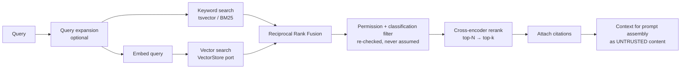

# ADR-008 — Vector Storage: pgvector First, Behind a Port, with a Measured Exit to Qdrant

| | |
|---|---|
| **Status** | Accepted |
| **Date** | 2026-08-09 |
| **Deciders** | AI/LLM Systems Architect, Database Architect, SRE |
| **Supersedes** | — |

---

## Context

Retrieval feeds two consumers: agent memory (episodic + semantic, FR-410) and document RAG (FR-501/502).
Both are **tenant-scoped, permission-filtered, and hybrid** — pure vector similarity is not sufficient, because
operational questions contain exact tokens (order IDs, SKUs, error codes) that dense embeddings handle poorly.

The dominant constraint is not ANN quality. It is **filtered search correctness**: every query must be
restricted to one tenant, and often further restricted by document ACL, classification, and recency. A vector
store that applies filters *after* retrieving top-k (post-filtering) will silently return fewer — or zero —
results for a small tenant while happily scanning another tenant's vectors first. That is both a relevance bug
and a tenant-isolation smell.

## Requirements driving this decision

FR-410 (three-tier memory) · FR-502 (hybrid retrieval + reranking) · FR-503 (tenant-scoped at the storage
layer, not the query layer alone) · NFR-101/102 (latency) · NFR-404 (scale) · INV-13/INV-14.

## Considered alternatives

### A. pgvector (PostgreSQL extension) *(chosen for now)*

**Advantages**
- **The chunk row and its vector live in the same table**, so tenant filtering, ACL filtering, and metadata
  filtering are ordinary SQL predicates — and **RLS applies to vector queries automatically**. This is the
  decisive property: FR-503 ("the store itself must refuse") is satisfied by a mechanism we already trust for
  every other table, rather than by a second, differently-shaped isolation model.
- Ingestion is transactional with document state (INV-04): a document, its chunks, its embeddings, and the
  outbox event commit together. With an external store, "document says indexed, vectors missing" is a real and
  annoying failure mode.
- No new cluster, backup story, failover story, or on-call surface ([ADR-002](ADR-002-database.md)).
- HNSW indexing with good recall at our near-term scale; exact search remains available for small tenants,
  which is a genuine advantage — a tenant with 800 chunks gets perfect recall with no index tuning.
- Joins to `documents`, `memberships`, and classification tables come free.

**Disadvantages**
- ANN performance degrades relative to purpose-built engines as index size grows; HNSW index build is
  memory-hungry and slow at tens of millions of vectors.
- Index rebuilds after large re-embeddings are heavy operations on the primary.
- Fewer retrieval-specific features (native reranking, multi-vector, quantization variants) than dedicated engines.
- Vector data inflates the primary's size and backup times, competing with OLTP working set for cache.

### B. Qdrant

**Advantages**
- Purpose-built: excellent filtered ANN with **pre-filtering** (filters applied during traversal, not after),
  which is exactly the property our tenant-scoped queries need at scale.
- Payload indexes, quantization, and horizontal scaling; strong performance at 10⁷–10⁹ vectors.
- Collection-per-tenant or payload-filter-per-tenant both viable for isolation.

**Disadvantages**
- A second source of truth for a derived artifact → embeddings can drift from documents; requires a
  reconciliation job we would have to build and monitor.
- Second cluster: backups, upgrades, failover, capacity, and DR must independently meet NFR-203/204.
- Isolation now depends on *our* query construction discipline instead of the database's RLS. Every query site
  is a potential cross-tenant leak — the exact failure mode FR-503 exists to prevent.
- Cross-store joins (chunk → document → ACL) move into application code.

### C. Weaviate

**Advantages:** integrated hybrid search (BM25 + vector) with built-in fusion, module ecosystem, GraphQL API,
multi-tenancy as a first-class concept.
**Disadvantages:** heavier operational footprint; opinionated schema model that would duplicate our document
model; the built-in hybrid fusion is convenient but less controllable than our own fusion + reranking pipeline;
same dual-source-of-truth problem as (B).

### D. A managed vendor vector service
**Advantages:** zero ops. **Disadvantages:** residency constraints (NFR-601) conflict with a single-region
vendor; tenant data leaves our boundary; cost scales unpleasantly with vector count; least controllable of all
options for a core-adjacent capability.

## Decision

**Use pgvector as the vector store, behind `Nexus::Knowledge::VectorStore` (a port), with pre-committed,
measured exit criteria to Qdrant.**

The port exists from day one — not because we expect to switch soon, but because the switch must be a
**configuration and backfill exercise**, not a rewrite of every retrieval call site.

```ruby
# Port contract (abbreviated)
# upsert(tenant:, namespace:, records:)      # records: id, vector, metadata
# search(tenant:, namespace:, vector:, k:, filter:, min_score:)
# delete(tenant:, namespace:, ids:)
# rebuild_namespace(tenant:, namespace:)
```

`tenant:` is a **required, non-nullable argument on every method**. There is no way to call the port without
one; a nil tenant raises. This is layer (c) of INV-14 expressed in the API's type shape — the same discipline
that makes RLS layer (a) meaningful.

### Exit criteria to Qdrant (any one triggers the migration project)

| Signal | Threshold |
|--------|-----------|
| Corpus size | > ~50 M chunks in a single region |
| Recall | recall@10 < 0.90 against a labeled eval set at the required latency |
| Latency | Retrieval p95 > 200 ms with correct indexes and adequate memory |
| Index maintenance | HNSW rebuild cannot complete inside the maintenance window |
| Primary contention | Vector workload measurably degrades OLTP p95 after read-replica offload |

Until one of those is measured, adding a vector database is **forbidden** — it would be complexity purchased
without evidence, which is precisely what [ADR-002](ADR-002-database.md) sets thresholds to prevent.

## Retrieval design (independent of the store)

The pipeline is deliberately store-agnostic, so the exit above changes one stage only:



Two rules that are load-bearing and easy to get wrong:

1. **Permissions are re-checked after fusion, never assumed from the index.** Index-time ACL snapshots go stale
   the moment a permission changes; a stale ACL in a vector payload is a data leak with a plausible-looking
   audit trail.
2. **Retrieved text enters the prompt as untrusted content** (INV-19, [ADR-007](ADR-007-ai-runtime.md)
   Decision 4). Retrieval quality and retrieval safety are separate problems and both must be solved.

## Embedding strategy

- One embedding model per namespace, with the model ID and dimension recorded on every row. Mixing models in a
  namespace produces silently wrong similarity — so it is prevented by a check constraint, not a convention.
- Re-embedding creates a **new namespace version**, backfills, verifies, then atomically swaps — the same
  shadow-and-swap pattern used for projection rebuilds (UC-07). No in-place mutation of a live namespace.
- Embedding cost is metered per tenant (FR-703) like any other AI spend.

## Consequences

- Retrieval code depends only on the port; `pgvector_store.rb` is the only file that knows about `vector` columns.
- Vector tables are partitioned by tenant hash and participate in RLS like every other business table.
- A retrieval-quality eval set exists per major corpus type and runs in CI; recall regressions fail the build.
- Any proposal to add a vector database must cite a measured exit criterion, in an ADR.

## Failure modes

| Failure mode | Detection | Impact | Mitigation |
|--------------|-----------|--------|------------|
| HNSW index bloat / degraded recall after churn | Periodic recall eval | Worse answers, silently | Scheduled recall eval with alerting; rebuild via shadow namespace |
| Index build blocks writes | Build duration monitor | Ingestion stalls | `CONCURRENTLY`; build on replica where possible; off-peak scheduling |
| Dimension mismatch after model change | Check constraint violation at write | Ingestion fails loudly (good) | Namespace versioning; constraint is deliberate |
| Cross-tenant retrieval | Isolation test suite + RLS | **Breach** | RLS + mandatory tenant argument + post-fusion ACL re-check (three independent layers) |
| Poisoned embeddings (adversarial document) | Ingestion anomaly detection; source provenance | Skewed retrieval | Provenance recorded per chunk; untrusted framing limits blast radius; quarantine + re-index path |
| Vector storage crowds out OLTP cache | Buffer cache hit ratio; OLTP p95 | Latency regression platform-wide | Separate tablespace; read-replica offload; exit criterion |
| Embedding provider outage | Error rate | Ingestion backlog | Queue and retry; documents stay `indexing`; retrieval degrades to keyword-only rather than failing |

That last row matters: **hybrid retrieval degrades gracefully**. If embeddings are unavailable, keyword search
still answers; if the keyword index is rebuilding, vectors still answer. Neither path is a single point of failure.

## Operational impact

Adds index maintenance and a recall-eval schedule to the database's operational surface. Avoids an entire
second datastore's DR, upgrade, and on-call burden — for now, and explicitly conditionally.

## Cost impact

Storage: ~4 bytes/dimension/vector plus index overhead (roughly 2–4 KB per chunk at 768 dimensions with HNSW).
Modeled in [capacity planning](../10-performance/capacity-planning.md). Embedding generation is a per-tenant
metered AI cost. Qdrant's cost crossover — where a dedicated cluster is cheaper than oversizing the primary — is
part of the exit analysis rather than an assumption.

## Security impact

Strongly positive relative to (B)/(C)/(D): tenant isolation for vectors is enforced by the same RLS mechanism
as every other table, so there is no second isolation model to review, test, or get wrong. Embeddings are
treated as **derived personal data** — they are covered by the same retention and crypto-shredding rules as
their source documents ([data retention](../06-data/data-retention.md)), because an embedding of a
personal-data chunk is still personal data.

## Scalability impact

Comfortable to ~10⁷ chunks per region with HNSW and adequate memory; the exit criteria define where "comfortable"
ends. Because retrieval is per-tenant, sharding by tenant (the dedicated tier in
[ADR-009](ADR-009-multi-tenancy.md)) is a viable scaling path *before* changing store technology.

## Related decisions

[ADR-002](ADR-002-database.md) · [ADR-007](ADR-007-ai-runtime.md) · [ADR-009](ADR-009-multi-tenancy.md)

## Related code

`apps/control-plane/domains/documents/internal/vector_store/` ·
`domains/documents/internal/retrieval/` · `domains/documents/internal/embedding/`

## Related diagrams

[Vector storage](../06-data/vector-storage.md) · [RAG](../05-ai/rag.md) · [Search](../06-data/search.md)
