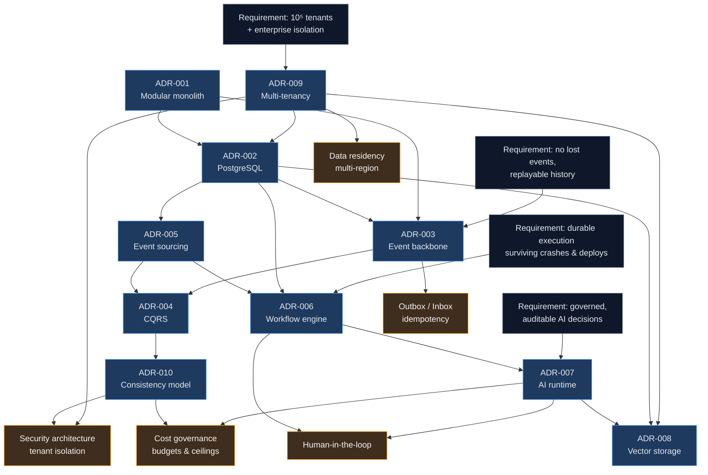

# Architecture Decision Records

> **What an ADR is here:** the durable record of *why* a decision was made, what was rejected, and what would
> make us change our minds. It is written **before** implementation ([INV-25](../02-architecture/architecture-constitution.md#inv-25--significant-architectural-decisions-have-an-adr-written-before-implementation))
> and is never retrofitted to justify code that already exists.
>
> **What an ADR is not:** documentation of how something works. That lives in the domain and subsystem docs.
> An ADR explains the fork in the road; the other docs describe the road.

---

## Index

| ADR | Decision | Status | The one-line reason |
|-----|----------|--------|---------------------|
| [001](ADR-001-architecture-style.md) | Modular monolith with independently scaled process roles | Accepted | The requirement was independent *scaling*, not independent *deployment*; extraction stays cheap if boundaries hold |
| [002](ADR-002-database.md) | PostgreSQL as the single authoritative datastore | Accepted | One transaction boundary makes the outbox structural instead of protocol-based |
| [003](ADR-003-event-bus.md) | Kafka for the log, DB job queue for scheduling, one narrow transport port | Accepted | The event log and the scheduler are different problems with incompatible optimal solutions |
| [004](ADR-004-cqrs.md) | CQRS per bounded context, not globally | Accepted | Applied where read and write requirements genuinely conflict; authorization must stay strongly consistent |
| [005](ADR-005-event-sourcing.md) | Event sourcing for exactly four aggregates | Accepted | Used where history *is* the product requirement; explicitly harmful for credentials |
| [006](ADR-006-workflow-engine.md) | Build the durable workflow engine on PostgreSQL | Accepted | Workflows are tenant-authored *data* with platform-enforced governance, not deployed code |
| [007](ADR-007-ai-runtime.md) | Own the agent loop; abstract the provider; route by tier | Accepted | Governance control points must sit between every model turn and tool call, and must suspend for days |
| [008](ADR-008-vector-database.md) | pgvector behind a port, with measured exit criteria | Accepted | RLS applies to vector queries automatically; a second store would need a second isolation model |
| [009](ADR-009-multi-tenancy.md) | Hybrid: RLS pool + database-per-tenant dedicated tier | Accepted | One codebase, two topologies; the dedicated tier is also the scaling escape hatch |
| [010](ADR-010-consistency-model.md) | Declared consistency class per operation | Accepted | Anything that can *deny* an action must read strongly consistent state |
| [011](ADR-011-authentication.md) | Stateless access tokens carrying identity only | Accepted | Identity may be briefly stale; permissions may not — so the token asserts who, never what |
| [012](ADR-012-domain-schema.md) | Domain schema unpartitioned; two tables deliberately missing | Accepted | A partition without a policy is a cross-tenant read; partitioning later is merely expensive |
| [013](ADR-013-tenant-enumeration.md) | Platform processes enumerate tenants from a directory | Accepted | A correctly isolated system cannot list its own tenants; the alternative was a role that reads across them |

---

## The decision graph

Decisions are not independent. This graph shows which decisions constrain which — read an edge as
"changing the source forces re-examination of the target".

### Reading the graph — the load-bearing chains

**Chain 1 — tenancy determines almost everything downstream.**
`ADR-009` → `ADR-002` (RLS requires a database that has RLS) → `ADR-008` (vectors inherit RLS) → security and
residency. Changing the tenancy model invalidates the isolation argument in three other decisions, which is
why it is among the hardest to revisit.

**Chain 2 — durability determines the workflow and AI design.**
`ADR-002` → `ADR-006` (durable state in Postgres) → `ADR-007` (agent invocation is a workflow step, so
human approval can suspend for days) → human-in-the-loop. Replacing the workflow engine changes how AI
approvals suspend, which changes the AI runtime's loop ownership argument.

**Chain 3 — messaging determines consistency vocabulary.**
`ADR-003` → `ADR-004` → `ADR-010`. Ordering and delivery guarantees set the ceiling on what consistency
classes are achievable; a broker change with different ordering semantics rewrites the consistency model.

**Chain 4 — the architecture style is the cheapest to revisit.**
`ADR-001` constrains `ADR-002`/`ADR-003` only through the shared-transaction assumption. Because INV-01/INV-02
keep contexts separable, extracting a service changes deployment without invalidating the domain decisions —
by design.

---

## Writing an ADR

Copy [`_template.md`](_template.md). Every section is required; "N/A" with a reason is an acceptable answer,
silence is not.

| Section | What reviewers actually look for |
|---------|----------------------------------|
| Context | The forces in tension, not a feature description |
| Requirements | Specific FR/NFR IDs from [requirements.md](../01-product/requirements.md) |
| Considered alternatives | Each with genuine advantages — an alternative with no upside was not considered, it was dismissed |
| Decision | Unambiguous, in one paragraph |
| Why | The asymmetry that made this the right call |
| Consequences | Including the obligations this creates for future work |
| Failure modes | Detection, impact, mitigation — as a table |
| Operational / Cost / Security / Scalability impact | Honest, including negatives |
| Related decisions / code / diagrams | Real paths; `docs-lint` verifies they exist |

**The honesty rule.** If the decision is risky, say so and pre-commit the evidence that would reverse it —
see [ADR-006](ADR-006-workflow-engine.md)'s migration triggers and [ADR-008](ADR-008-vector-database.md)'s exit
criteria. An ADR that reads as though the decision was obvious is usually hiding the interesting part.

## Superseding an ADR

Never edit a decision's substance after acceptance. Instead:

1. Write a new ADR that references the old one and explains what changed in the world.
2. Set the old ADR's status to `Superseded by ADR-NNN` and leave everything else intact.
3. Update the [architecture changelog](../architecture-changelog.md) and any dependent diagrams and docs in
   the same change (INV-26).

The old reasoning stays readable. Deleting it destroys the only record of why the system was ever the other way.
